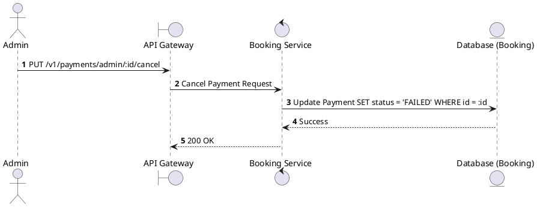
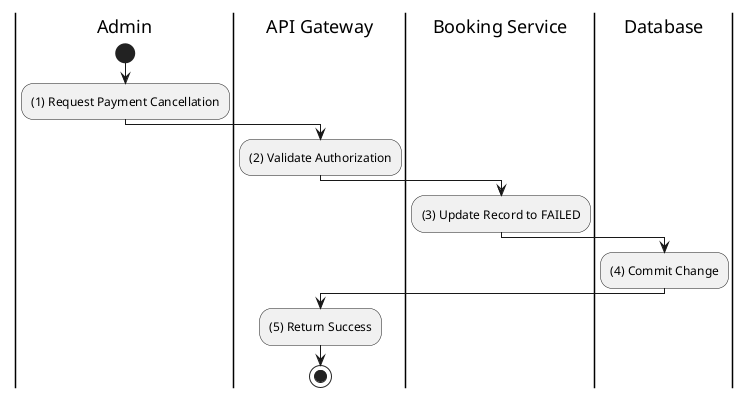

# [PY-A03] Cancel Payment

## 1. Description

| Field | Details |
| :--- | :--- |
| **Name** | Cancel Payment |
| **Functional ID** | PY-A03 |
| **Description** | Allows an Admin to manually mark a PENDING or PROCESSING payment as FAILED/CANCELLED. |
| **Actor** | Admin |
| **Trigger** | `PUT /v1/payments/admin/:id/cancel` |
| **Pre-condition** | Admin authenticated; Payment exists. |
| **Post-condition** | Payment status updated. |

## 2. Sequence Flow

## 3. Activity Flow

## 4. Business Rules

| Activity Step | Rule ID | Description |
| :--- | :--- | :--- |
| (3) | N/A | Does not trigger a refund at the gateway; only updates internal status. |
