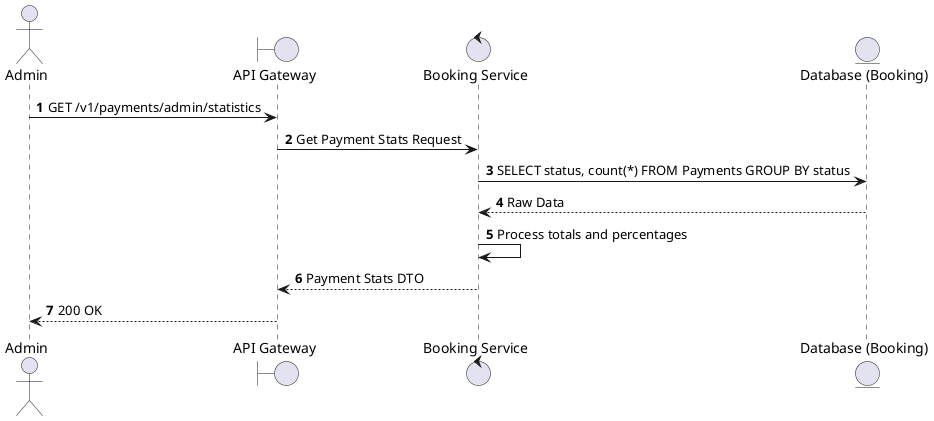
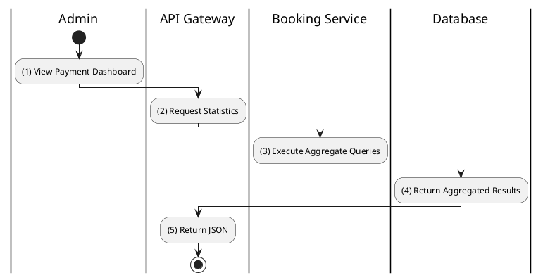

# [PY-A04] Get Payment Statistics

## 1. Description

| Field | Details |
| :--- | :--- |
| **Name** | Get Payment Statistics |
| **Functional ID** | PY-A04 |
| **Description** | Provides a summary of payment transactions, such as success rate and distribution of payment methods. |
| **Actor** | Admin |
| **Trigger** | `GET /v1/payments/admin/statistics` |
| **Pre-condition** | Admin authenticated. |
| **Post-condition** | Statistical data returned. |

## 2. Sequence Flow

## 3. Activity Flow

## 4. Business Rules

| Activity Step | Rule ID | Description |
| :--- | :--- | :--- |
| (3) | N/A | Statistics help monitor gateway stability and user preferences. |
