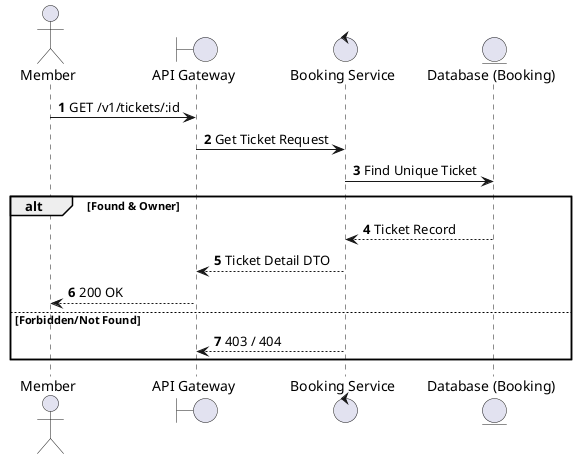
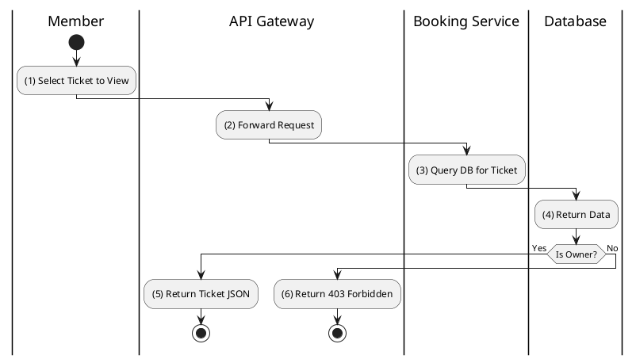

# [TK-01] Get Ticket Details

## 1. Description

| Field | Details |
| :--- | :--- |
| **Name** | Get Ticket Details |
| **Functional ID** | TK-01 |
| **Description** | Retrieves full information about a specific digital ticket, including seat number, showtime details, and its current validity status. |
| **Actor** | Member |
| **Trigger** | `GET /v1/tickets/:id` |
| **Pre-condition** | Member authenticated; Ticket ID exists and belongs to the member. |
| **Post-condition** | Ticket details returned. |

## 2. Sequence Flow

## 3. Activity Flow

## 4. Business Rules

| Activity Step | Rule ID | Description |
| :--- | :--- | :--- |
| (3) | N/A | Ticket status must be one of the `TicketStatus` enum values. |
| (3) | N/A | Only the member who bought the ticket can view its detailed information. |
