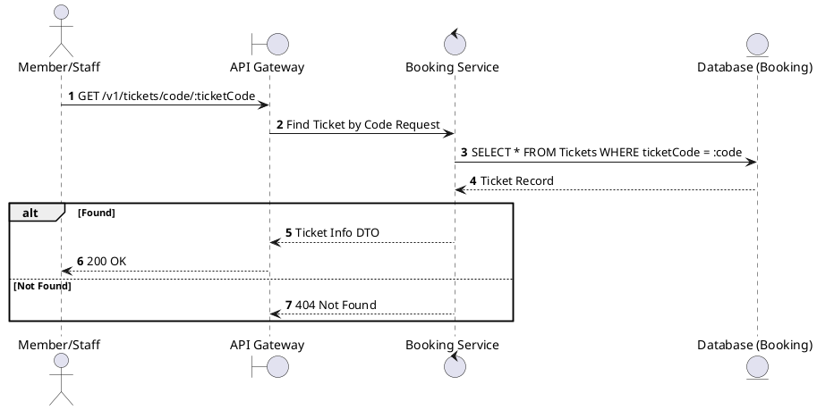
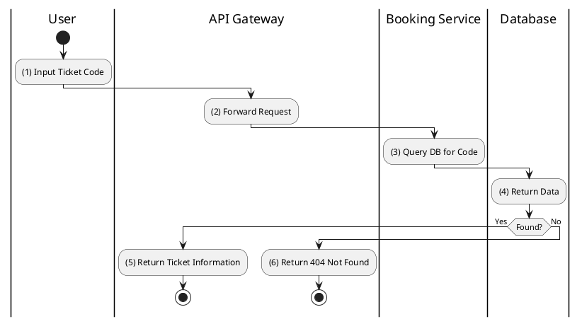

# [TK-02] Find Ticket by Code

## 1. Description

| Field | Details |
| :--- | :--- |
| **Name** | Find Ticket by Code |
| **Functional ID** | TK-02 |
| **Description** | Allows a Member or Staff to retrieve ticket information using the unique alphanumeric ticket code (e.g., from a search or manual entry). |
| **Actor** | Member, Staff |
| **Trigger** | `GET /v1/tickets/code/:ticketCode` |
| **Pre-condition** | User authenticated; Ticket code exists. |
| **Post-condition** | Ticket information returned. |

## 2. Sequence Flow

## 3. Activity Flow

## 4. Business Rules

| Activity Step | Rule ID | Description |
| :--- | :--- | :--- |
| (3) | N/A | Codes are unique across the entire system. |
| (3) | N/A | Staff can see any ticket, while Members can only see their own tickets. |
