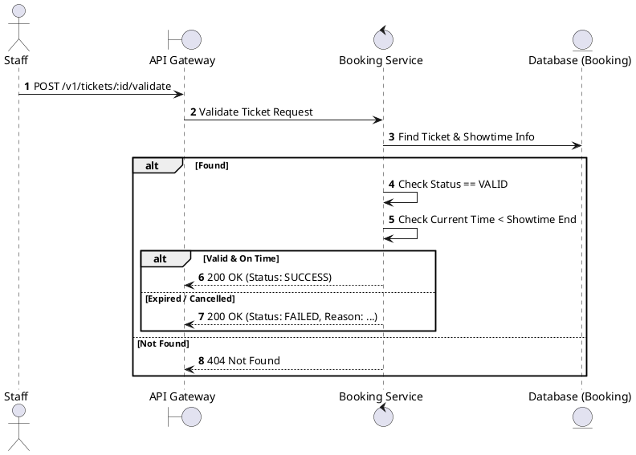
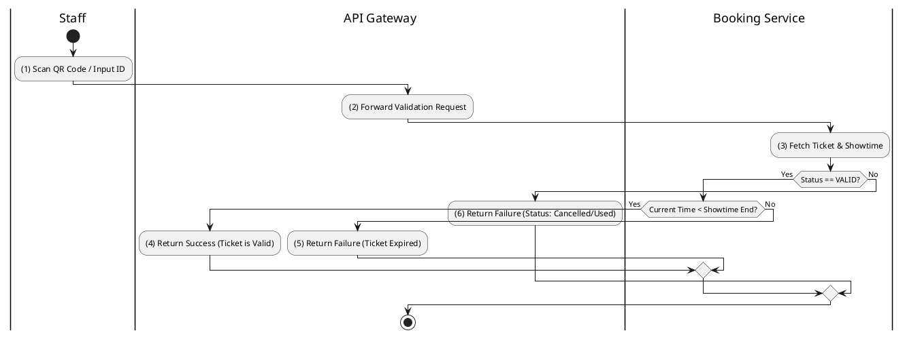

# [TK-03] Validate Ticket

## 1. Description

| Field | Details |
| :--- | :--- |
| **Name** | Validate Ticket |
| **Functional ID** | TK-03 |
| **Description** | Allows Staff to check the validity of a ticket (e.g., upon scanning QR code) without marking it as used. |
| **Actor** | Staff |
| **Trigger** | `POST /v1/tickets/:id/validate` |
| **Pre-condition** | Staff authenticated; Ticket ID exists. |
| **Post-condition** | Validation result (Valid/Invalid/Expired) returned. |

## 2. Sequence Flow

## 3. Activity Flow

## 4. Business Rules

| Activity Step | Rule ID | Description |
| :--- | :--- | :--- |
| (3) | SRS 5.2 | Valid states for validation: `VALID`. |
| (3) | General | Tickets cannot be validated after the movie showtime has ended. |
