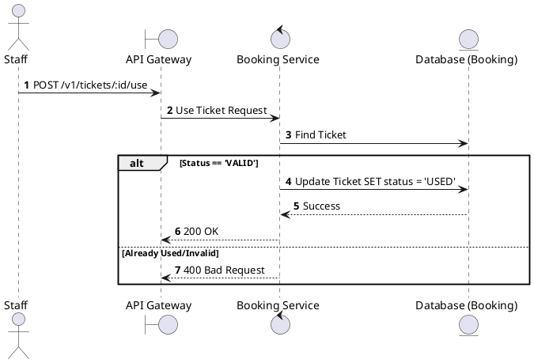
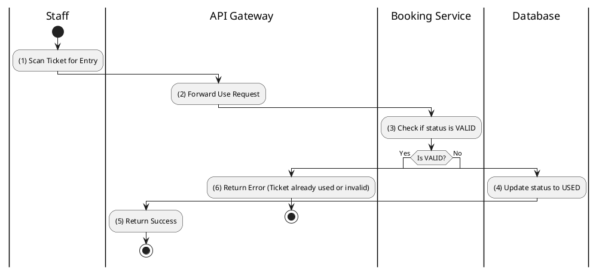

# [TK-04] Use Ticket (Mark Entry)

## 1. Description

| Field | Details |
| :--- | :--- |
| **Name** | Use Ticket (Mark Entry) |
| **Functional ID** | TK-04 |
| **Description** | Marks a ticket as `USED` when the customer enters the cinema hall. This prevents the same ticket from being used twice. |
| **Actor** | Staff |
| **Trigger** | `POST /v1/tickets/:id/use` |
| **Pre-condition** | Staff authenticated; Ticket status is `VALID`. |
| **Post-condition** | Ticket status updated to `USED`. |

## 2. Sequence Flow

## 3. Activity Flow

## 4. Business Rules

| Activity Step | Rule ID | Description |
| :--- | :--- | :--- |
| (3) | SRS 5.2 | A ticket can only be transitioned to `USED` from `VALID` status. |
| (4) | N/A | The timestamp of usage should be recorded for auditing. |
