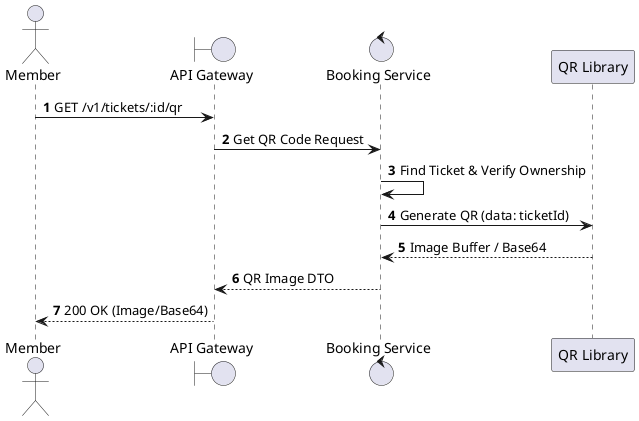
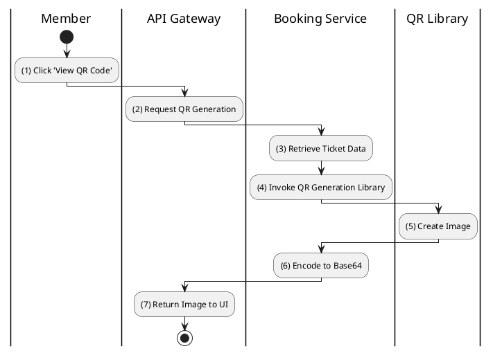

# [TK-05] Generate QR Code

## 1. Description

| Field | Details |
| :--- | :--- |
| **Name** | Generate QR Code |
| **Functional ID** | TK-05 |
| **Description** | Generates a base64-encoded QR code image containing the unique ticket ID or code for scanning. |
| **Actor** | Member |
| **Trigger** | `GET /v1/tickets/:id/qr` |
| **Pre-condition** | Ticket exists and belongs to the Member. |
| **Post-condition** | QR Code image (base64) returned. |

## 2. Sequence Flow

## 3. Activity Flow

## 4. Business Rules

| Activity Step | Rule ID | Description |
| :--- | :--- | :--- |
| (4) | N/A | QR code typically contains the ticket's internal UUID or a specialized validation token. |
| (4) | SRS 1.2 | QR Code Generation technology: `qrcode` v1.5.4. |
