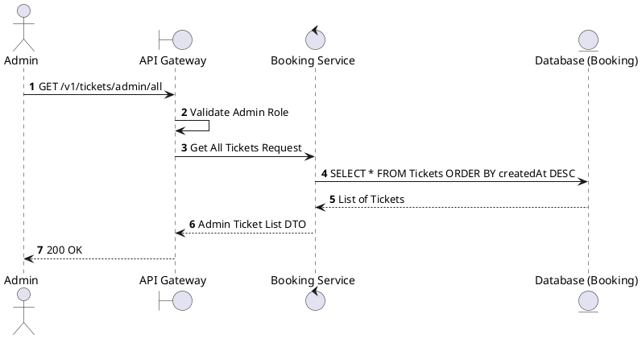
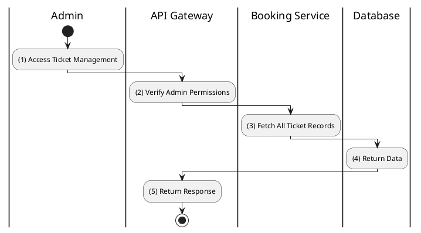

# [TK-A01] Admin List All Tickets

## 1. Description

| Field | Details |
| :--- | :--- |
| **Name** | Admin List All Tickets |
| **Functional ID** | TK-A01 |
| **Description** | Allows Administrators to view a paginated list of all tickets issued in the system. |
| **Actor** | Admin |
| **Trigger** | `GET /v1/tickets/admin/all` |
| **Pre-condition** | Admin authenticated. |
| **Post-condition** | List of all tickets returned. |

## 2. Sequence Flow

## 3. Activity Flow

## 4. Business Rules

| Activity Step | Rule ID | Description |
| :--- | :--- | :--- |
| (2) | N/A | Restricted to Admin users. |
| (3) | N/A | Includes ticket status, seat info, and associated booking ID. |
