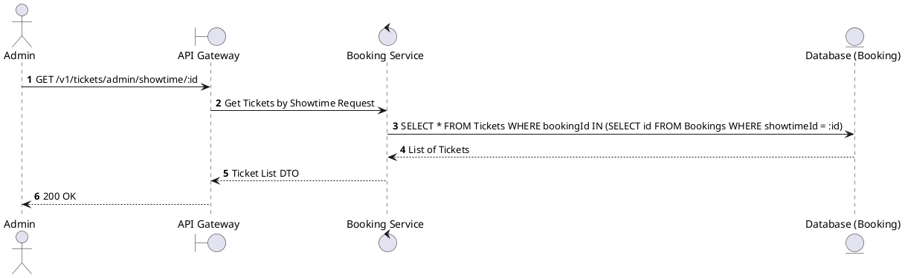
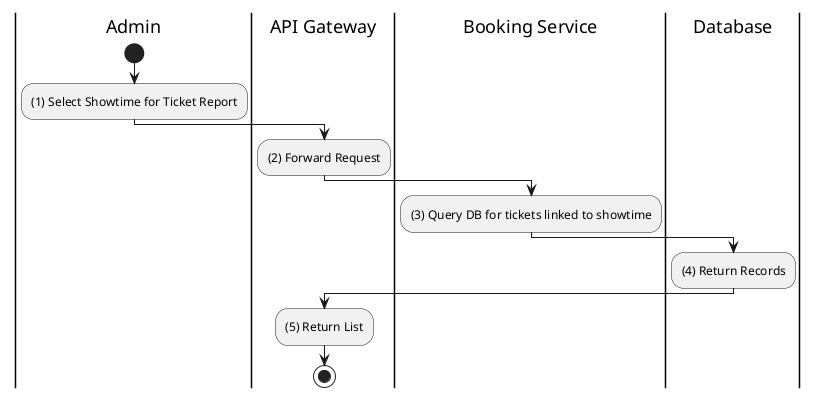

# [TK-A02] Find Tickets by Showtime

## 1. Description

| Field | Details |
| :--- | :--- |
| **Name** | Find Tickets by Showtime |
| **Functional ID** | TK-A02 |
| **Description** | Allows an Admin to view all tickets associated with a specific showtime. |
| **Actor** | Admin |
| **Trigger** | `GET /v1/tickets/admin/showtime/:showtimeId` |
| **Pre-condition** | Admin authenticated; Showtime ID exists. |
| **Post-condition** | List of tickets for the showtime returned. |

## 2. Sequence Flow

## 3. Activity Flow

## 4. Business Rules

| Activity Step | Rule ID | Description |
| :--- | :--- | :--- |
| (3) | N/A | Useful for verifying seat occupancy for a specific screening. |
| (3) | N/A | Includes status of each ticket (VALID, USED, CANCELLED). |
