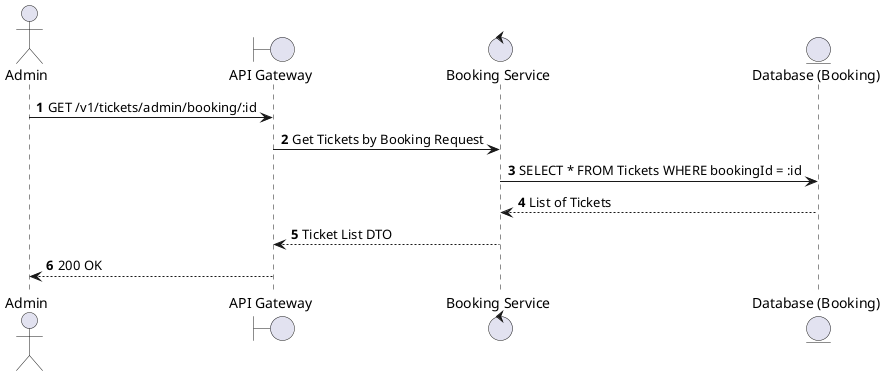
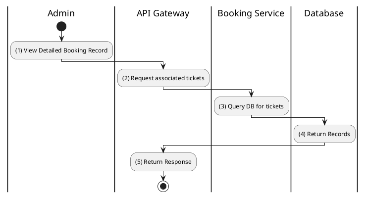

# [TK-A03] Find Tickets by Booking

## 1. Description

| Field | Details |
| :--- | :--- |
| **Name** | Find Tickets by Booking |
| **Functional ID** | TK-A03 |
| **Description** | Retrieves all tickets belonging to a specific booking ID. |
| **Actor** | Admin |
| **Trigger** | `GET /v1/tickets/admin/booking/:bookingId` |
| **Pre-condition** | Admin authenticated; Booking ID exists. |
| **Post-condition** | List of tickets for the booking returned. |

## 2. Sequence Flow

## 3. Activity Flow

## 4. Business Rules

| Activity Step | Rule ID | Description |
| :--- | :--- | :--- |
| (3) | N/A | A single booking can contain multiple tickets (up to 8, as per BR-SEAT-01). |
