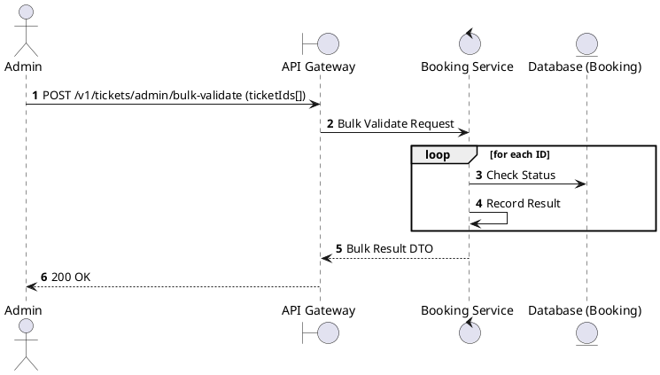
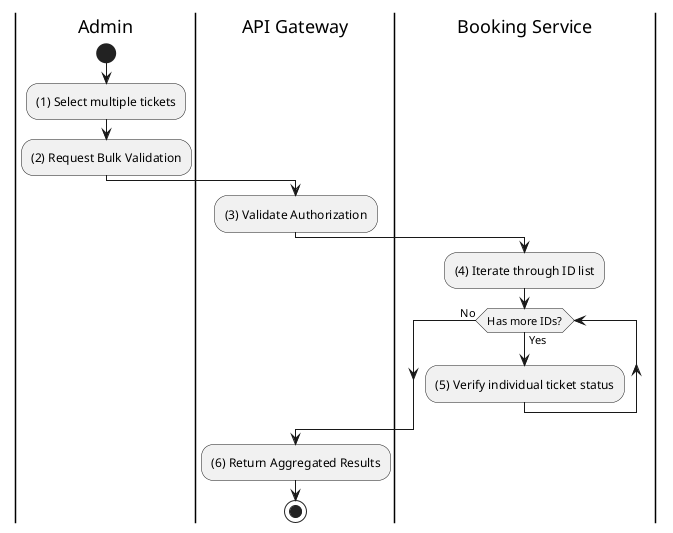

# [TK-A04] Bulk Validate Tickets

## 1. Description

| Field | Details |
| :--- | :--- |
| **Name** | Bulk Validate Tickets |
| **Functional ID** | TK-A04 |
| **Description** | Allows an Admin to validate a list of tickets simultaneously. |
| **Actor** | Admin |
| **Trigger** | `POST /v1/tickets/admin/bulk-validate` |
| **Pre-condition** | Admin authenticated; List of ticket IDs provided. |
| **Post-condition** | Validation report for all IDs returned. |

## 2. Sequence Flow

## 3. Activity Flow

## 4. Business Rules

| Activity Step | Rule ID | Description |
| :--- | :--- | :--- |
| (4) | N/A | Typically used for mass entry processing or system-wide checks. |
