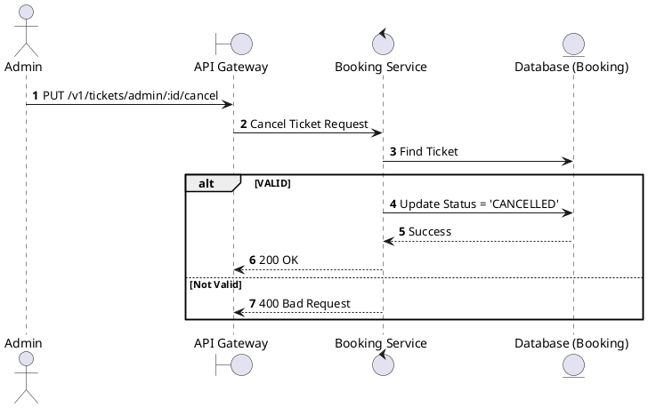
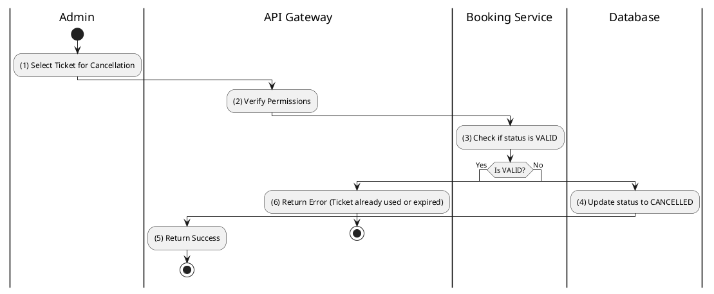

# [TK-A05] Cancel Ticket

## 1. Description

| Field | Details |
| :--- | :--- |
| **Name** | Cancel Ticket |
| **Functional ID** | TK-A05 |
| **Description** | Allows an Admin to manually cancel an individual ticket (without necessarily cancelling the entire booking). |
| **Actor** | Admin |
| **Trigger** | `PUT /v1/tickets/admin/:id/cancel` |
| **Pre-condition** | Admin authenticated; Ticket status is `VALID`. |
| **Post-condition** | Ticket status updated to `CANCELLED`. |

## 2. Sequence Flow

## 3. Activity Flow

## 4. Business Rules

| Activity Step | Rule ID | Description |
| :--- | :--- | :--- |
| (4) | SRS 5.2 | Transitioning a ticket to `CANCELLED` makes the corresponding seat available in the database (via cascading effects or manual trigger). |
