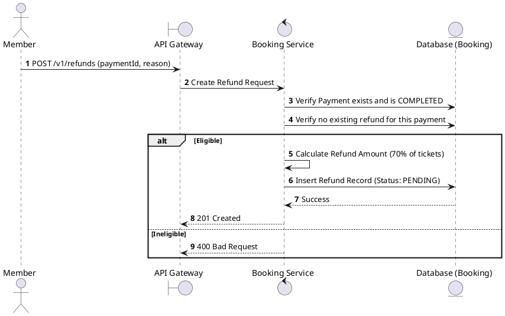
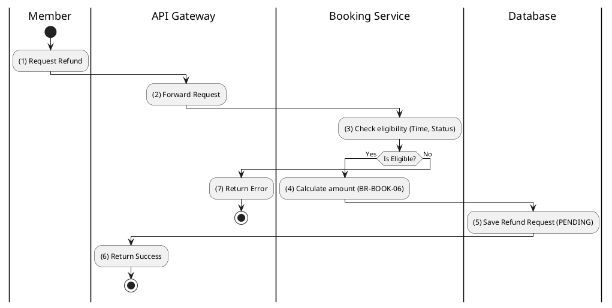

# [RF-01] Create Refund Request

## 1. Description

| Field | Details |
| :--- | :--- |
| **Name** | Create Refund Request |
| **Functional ID** | RF-01 |
| **Description** | Allows a Member to submit a formal request for a refund after cancelling a booking. |
| **Actor** | Member |
| **Trigger** | `POST /v1/refunds` |
| **Pre-condition** | Booking is `CANCELLED`; Payment status is `COMPLETED`; Request made within policy limits. |
| **Post-condition** | Refund record created with status `PENDING`. |

## 2. Sequence Flow

## 3. Activity Flow

## 4. Business Rules

| Activity Step | Rule ID | Description |
| :--- | :--- | :--- |
| (3) | BR-BOOK-05 | Cancellation must be made at least 2 hours before showtime to be eligible. |
| (4) | BR-BOOK-06 | Refund percentage on ticket cancellation: 70%. |
