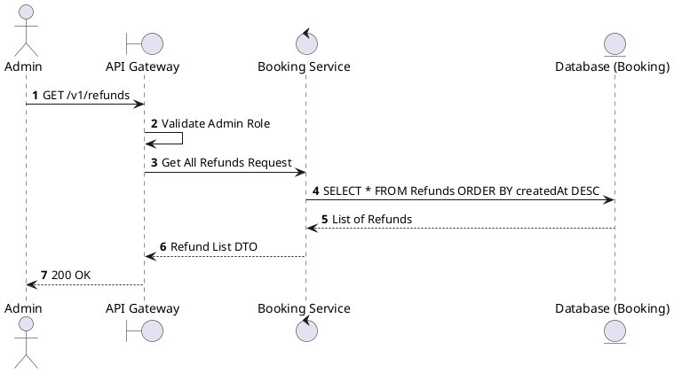
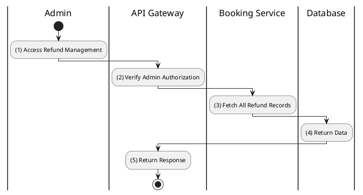

# [RF-02] List Refunds

## 1. Description

| Field | Details |
| :--- | :--- |
| **Name** | List Refunds |
| **Functional ID** | RF-02 |
| **Description** | Allows Administrators to view a list of all refund requests in the system. |
| **Actor** | Admin |
| **Trigger** | `GET /v1/refunds` |
| **Pre-condition** | Admin authenticated. |
| **Post-condition** | Paginated list of refund requests returned. |

## 2. Sequence Flow

## 3. Activity Flow

## 4. Business Rules

| Activity Step | Rule ID | Description |
| :--- | :--- | :--- |
| (2) | N/A | Restricted to Admin users. |
| (3) | N/A | DTO should include booking ID, user name, and requested amount. |
