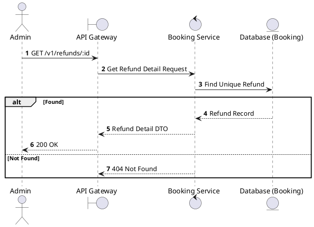
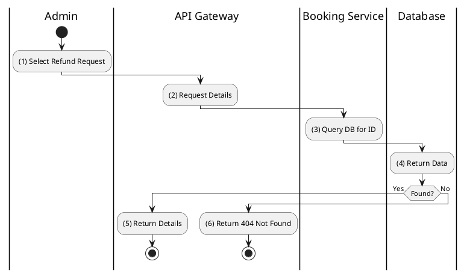

# [RF-03] Get Refund Details

## 1. Description

| Field | Details |
| :--- | :--- |
| **Name** | Get Refund Details |
| **Functional ID** | RF-03 |
| **Description** | Retrieves full information about a specific refund request. |
| **Actor** | Admin |
| **Trigger** | `GET /v1/refunds/:id` |
| **Pre-condition** | Admin authenticated; Refund ID exists. |
| **Post-condition** | Refund details returned. |

## 2. Sequence Flow

## 3. Activity Flow

## 4. Business Rules

| Activity Step | Rule ID | Description |
| :--- | :--- | :--- |
| (1) | N/A | Standard administrative read operation. |
