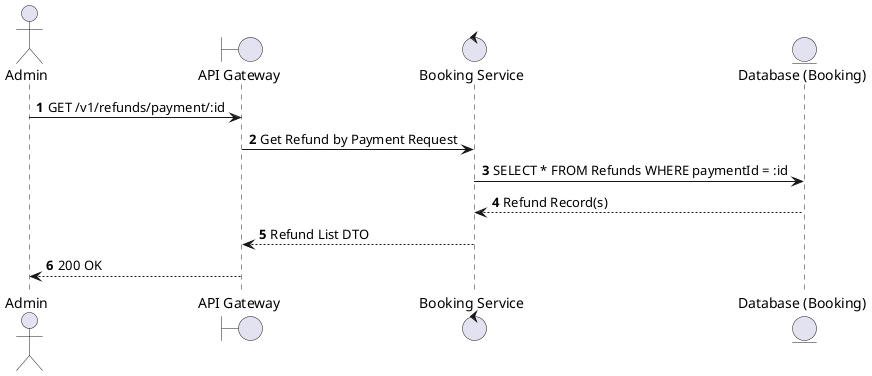
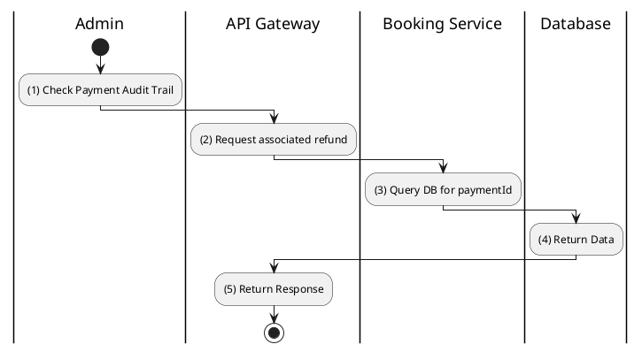

# [RF-04] Find Refunds by Payment

## 1. Description

| Field | Details |
| :--- | :--- |
| **Name** | Find Refunds by Payment |
| **Functional ID** | RF-04 |
| **Description** | Retrieves the refund request(s) associated with a specific payment transaction. |
| **Actor** | Admin |
| **Trigger** | `GET /v1/refunds/payment/:paymentId` |
| **Pre-condition** | Admin authenticated; Payment ID exists. |
| **Post-condition** | List of associated refund records returned. |

## 2. Sequence Flow

## 3. Activity Flow

## 4. Business Rules

| Activity Step | Rule ID | Description |
| :--- | :--- | :--- |
| (3) | N/A | Typically, only one refund is allowed per payment. |
| (3) | N/A | Used to track whether a payment has already been reversed. |
