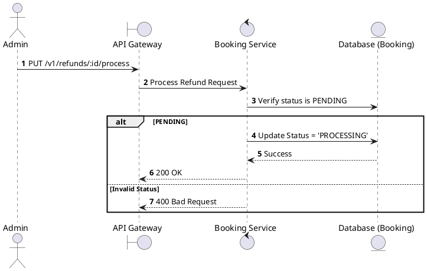
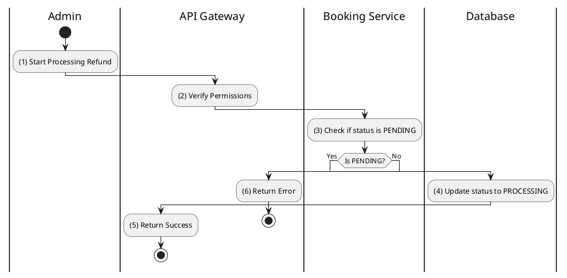

# [RF-05] Process Refund

## 1. Description

| Field | Details |
| :--- | :--- |
| **Name** | Process Refund |
| **Functional ID** | RF-05 |
| **Description** | Marks a refund request as `PROCESSING` while it is being handled by the finance department or gateway. |
| **Actor** | Admin |
| **Trigger** | `PUT /v1/refunds/:id/process` |
| **Pre-condition** | Admin authenticated; Refund status is `PENDING`. |
| **Post-condition** | Refund status updated to `PROCESSING`. |

## 2. Sequence Flow

## 3. Activity Flow

## 4. Business Rules

| Activity Step | Rule ID | Description |
| :--- | :--- | :--- |
| (4) | SRS 5.2 | Valid values for `RefundStatus`: `PENDING`, `PROCESSING`, `COMPLETED`, `FAILED`. |
