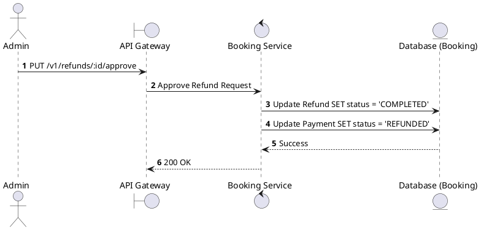
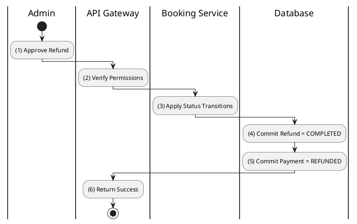

# [RF-06] Approve Refund

## 1. Description

| Field | Details |
| :--- | :--- |
| **Name** | Approve Refund |
| **Functional ID** | RF-06 |
| **Description** | Formally approves a refund request and updates its status to `COMPLETED`. |
| **Actor** | Admin |
| **Trigger** | `PUT /v1/refunds/:id/approve` |
| **Pre-condition** | Admin authenticated; Refund status is `PROCESSING`. |
| **Post-condition** | Refund status set to `COMPLETED`; Payment status updated to `REFUNDED`. |

## 2. Sequence Flow

## 3. Activity Flow

## 4. Business Rules

| Activity Step | Rule ID | Description |
| :--- | :--- | :--- |
| (4) | N/A | Approval assumes the money has been successfully sent back to the user's account. |
| (5) | N/A | Payment status synchronization is critical for financial reconciliation. |
