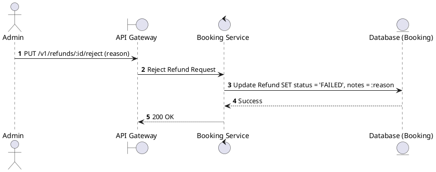
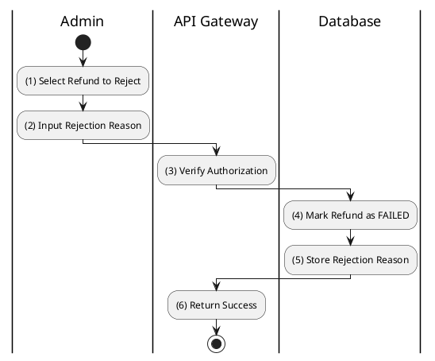

# [RF-07] Reject Refund

## 1. Description

| Field | Details |
| :--- | :--- |
| **Name** | Reject Refund |
| **Functional ID** | RF-07 |
| **Description** | Rejects a refund request (e.g., due to policy violation or invalid data) and updates its status to `FAILED`. |
| **Actor** | Admin |
| **Trigger** | `PUT /v1/refunds/:id/reject` |
| **Pre-condition** | Admin authenticated; Reason for rejection provided. |
| **Post-condition** | Refund status set to `FAILED`; Rejection reason logged. |

## 2. Sequence Flow

## 3. Activity Flow

## 4. Business Rules

| Activity Step | Rule ID | Description |
| :--- | :--- | :--- |
| (2) | N/A | A reason must be provided for all rejected refunds to maintain audit quality. |
