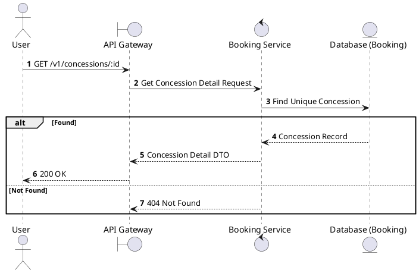
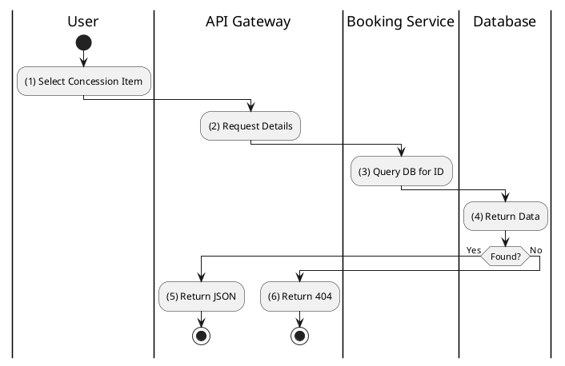

# [CS-02] Get Concession Details

## 1. Description

| Field | Details |
| :--- | :--- |
| **Name** | Get Concession Details |
| **Functional ID** | CS-02 |
| **Description** | Retrieves full information about a specific concession item, including description, ingredients, and nutritional info (if available). |
| **Actor** | Guest, Member |
| **Trigger** | `GET /v1/concessions/:id` |
| **Pre-condition** | Concession ID exists. |
| **Post-condition** | Detailed concession information returned. |

## 2. Sequence Flow

## 3. Activity Flow

## 4. Business Rules

| Activity Step | Rule ID | Description |
| :--- | :--- | :--- |
| (1) | N/A | Standard read operation for a single concession item. |
