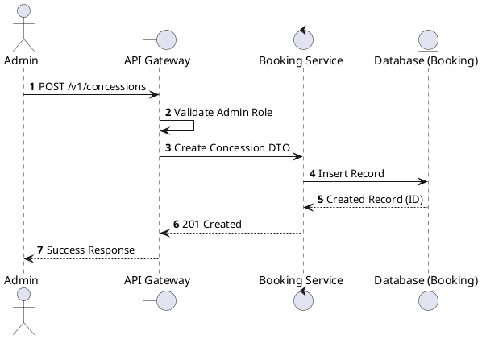
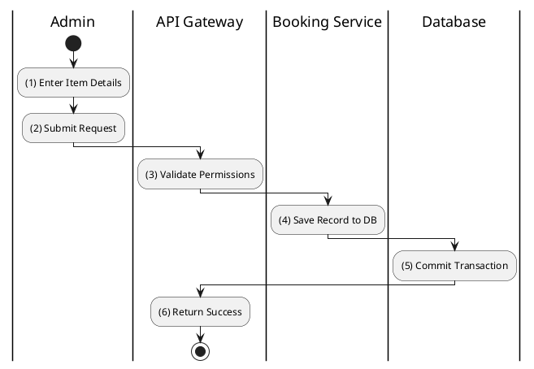

# [CS-03] Create Concession

## 1. Description

| Field | Details |
| :--- | :--- |
| **Name** | Create Concession |
| **Functional ID** | CS-03 |
| **Description** | Allows an Administrator to add a new food or beverage item to the catalog. |
| **Actor** | Admin |
| **Trigger** | `POST /v1/concessions` |
| **Pre-condition** | Admin authenticated; Valid payload (Name, Price, Category). |
| **Post-condition** | New concession record created. |

## 2. Sequence Flow

## 3. Activity Flow

## 4. Business Rules

| Activity Step | Rule ID | Description |
| :--- | :--- | :--- |
| (1) | SRS 5.1 | Required: Name, Price, Category. Optional: Description, Image URL. |
| (1) | SRS 5.2 | Category must be a valid `ConcessionCategory` enum member. |
