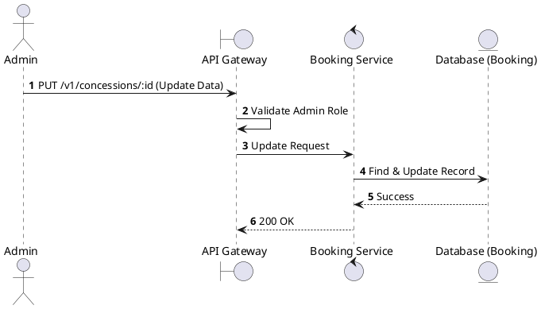
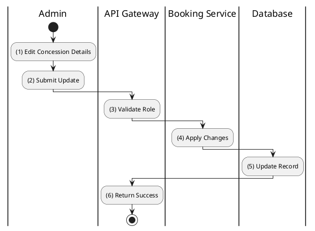

# [CS-04] Update Concession

## 1. Description

| Field | Details |
| :--- | :--- |
| **Name** | Update Concession |
| **Functional ID** | CS-04 |
| **Description** | Modifies the information of an existing concession item. |
| **Actor** | Admin |
| **Trigger** | `PUT /v1/concessions/:id` |
| **Pre-condition** | Admin authenticated; Concession ID exists. |
| **Post-condition** | Concession record updated. |

## 2. Sequence Flow

## 3. Activity Flow

## 4. Business Rules

| Activity Step | Rule ID | Description |
| :--- | :--- | :--- |
| (4) | N/A | Can update price, name, category, or description. |
| (4) | N/A | Price updates only affect future transactions. |
