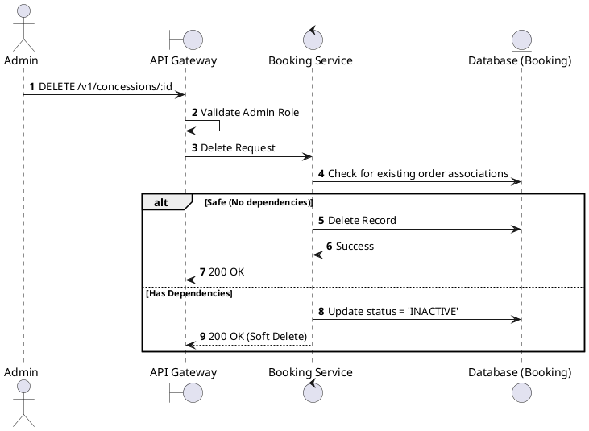
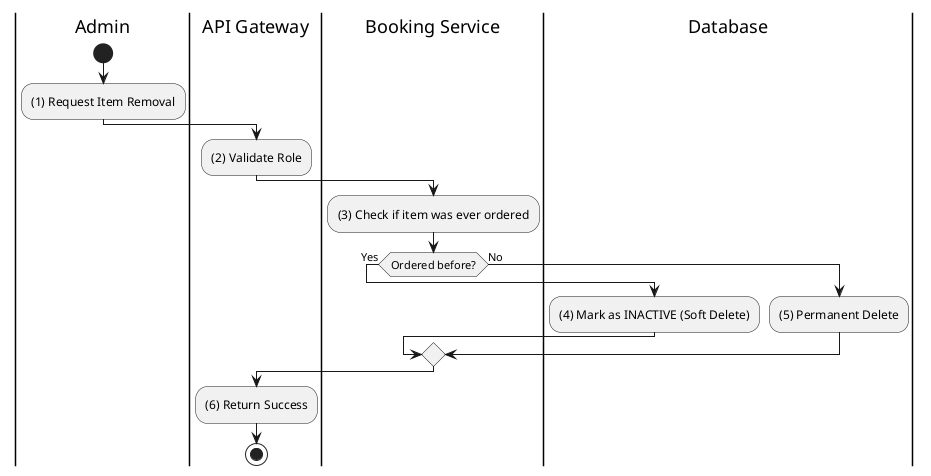

# [CS-05] Delete Concession

## 1. Description

| Field | Details |
| :--- | :--- |
| **Name** | Delete Concession |
| **Functional ID** | CS-05 |
| **Description** | Removes a concession item from the catalog or marks it as inactive. |
| **Actor** | Admin |
| **Trigger** | `DELETE /v1/concessions/:id` |
| **Pre-condition** | Admin authenticated; Concession exists. |
| **Post-condition** | Concession removed or status set to INACTIVE. |

## 2. Sequence Flow

## 3. Activity Flow

## 4. Business Rules

| Activity Step | Rule ID | Description |
| :--- | :--- | :--- |
| (3) | General | Items with transaction history should be soft-deleted to maintain data integrity for reporting. |
