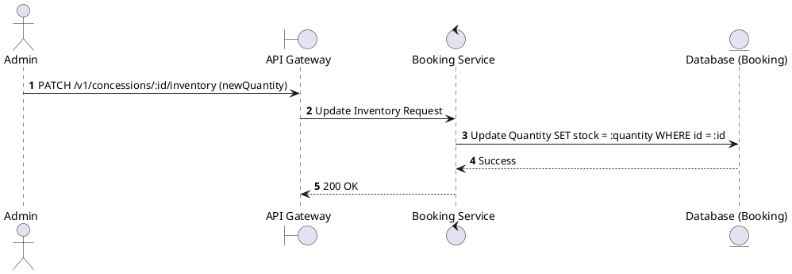
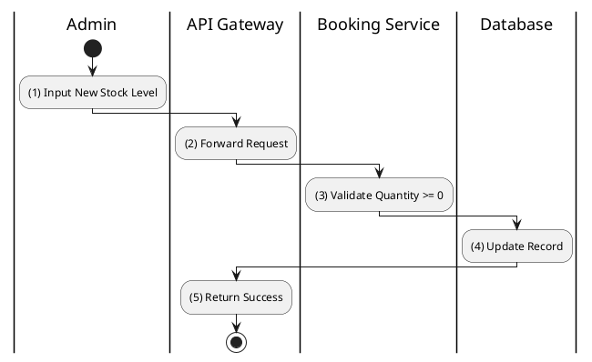

# [CS-06] Update Inventory

## 1. Description

| Field | Details |
| :--- | :--- |
| **Name** | Update Inventory |
| **Functional ID** | CS-06 |
| **Description** | Allows an Administrator to update the available stock quantity for a concession item. |
| **Actor** | Admin |
| **Trigger** | `PATCH /v1/concessions/:id/inventory` |
| **Pre-condition** | Admin authenticated; Valid numeric quantity provided. |
| **Post-condition** | Stock level updated in database. |

## 2. Sequence Flow

## 3. Activity Flow

## 4. Business Rules

| Activity Step | Rule ID | Description |
| :--- | :--- | :--- |
| (3) | N/A | Inventory levels should decrement automatically when a booking is confirmed (if implemented in BK flow). |
| (3) | N/A | Stock quantity cannot be negative. |
