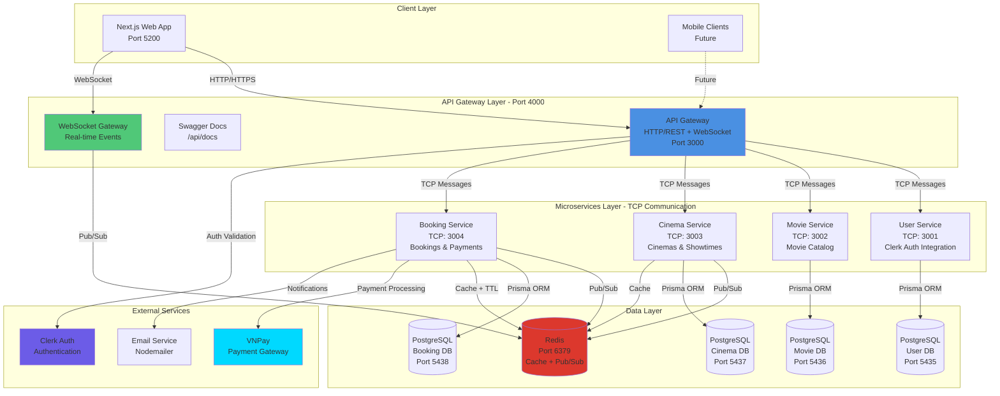
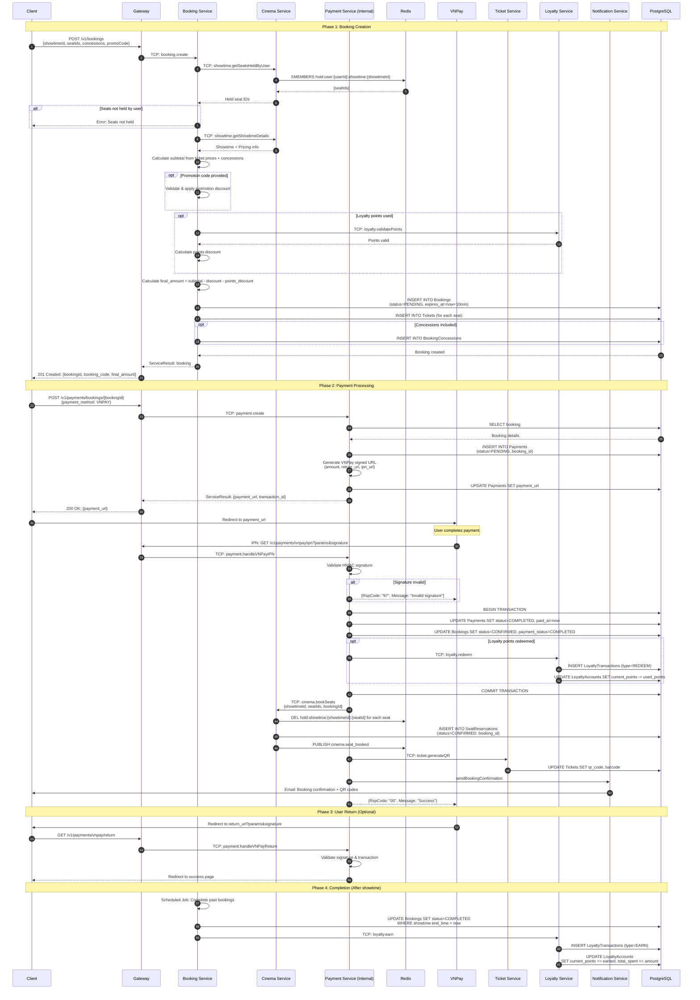
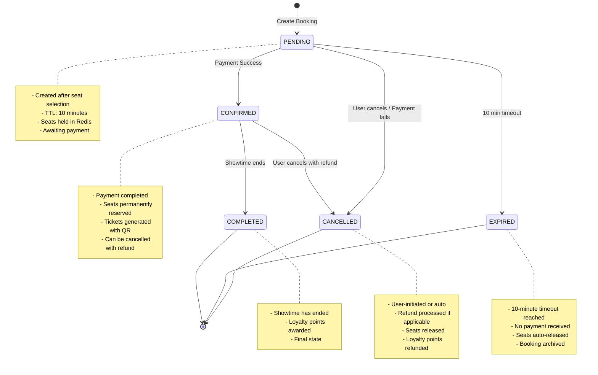
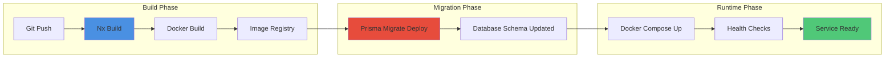

# MovieHub System Architecture

## Table of Contents

1. [High-Level System Architecture](#high-level-system-architecture)
2. [Technology Stack](#technology-stack)
3. [Deep-Dive: Booking Service Architecture](#deep-dive-booking-service-architecture)
4. [Communication Patterns](#communication-patterns)
5. [Infrastructure & Deployment](#infrastructure--deployment)

---

## High-Level System Architecture

### Overview

MovieHub is a **microservices-based cinema booking platform** built with NestJS, utilizing a distributed architecture pattern with API Gateway, multiple domain-specific services, and real-time capabilities via WebSocket and Redis Pub/Sub.

### System Architecture Diagram



### Architecture Highlights

#### **1. API Gateway Pattern**

- **Single Entry Point**: All client requests route through the API Gateway
- **Request Routing**: Distributes requests to appropriate microservices via TCP
- **Authentication**: Clerk-based authentication with JWT validation
- **API Documentation**: OpenAPI/Swagger specification
- **WebSocket Support**: Real-time bi-directional communication for seat booking

#### **2. Microservices Communication**

- **Transport**: TCP-based inter-service communication using NestJS Microservices
- **Message Patterns**: Request-response pattern for synchronous operations
- **Event-Driven**: Redis Pub/Sub for asynchronous, real-time events

#### **3. Database Per Service Pattern**

- Each microservice owns its dedicated PostgreSQL database
- **Isolation**: No direct database access between services
- **Data Consistency**: Services communicate via APIs/events for cross-domain data
- **Scalability**: Independent scaling of databases based on service load

#### **4. Caching & Session Management**

- **Redis**: Centralized cache for seat reservations, user sessions, and TTL-based holds
- **Keyspace Notifications**: Automatic expiration handling for held seats
- **Distributed State**: Shared state across multiple service instances

---

## Technology Stack

### Backend Framework

- **NestJS**: Node.js framework with TypeScript
- **Node.js**: Runtime environment
- **TypeScript**: Static typing and modern JavaScript features

### Databases

- **PostgreSQL 15**: Relational database for each microservice
- **Prisma ORM**: Type-safe database client and migrations
- **Redis 7**: In-memory data store for caching and pub/sub

### Communication

- **TCP**: Inter-service communication protocol
- **WebSocket (Socket.io)**: Real-time client-server communication
- **Redis Pub/Sub**: Event-driven messaging between services
- **REST API**: HTTP-based client-gateway communication

### Frontend

- **Next.js 15**: React framework with Server-Side Rendering
- **React 18**: UI library
- **TailwindCSS**: Utility-first CSS framework
- **shadcn/ui**: Re-usable component library

### Infrastructure & DevOps

- **Docker**: Containerization of services
- **Docker Compose**: Multi-container orchestration
- **Nx Monorepo**: Build system and monorepo management
- **Webpack**: Module bundler

### External Integrations

- **Clerk**: User authentication and management
- **VNPay**: Vietnamese payment gateway integration
- **Nodemailer**: Email notifications

### Development Tools

- **ESLint**: Code linting
- **Prettier**: Code formatting
- **Jest**: Unit and integration testing
- **TypeScript ESLint**: TypeScript-specific linting rules

---

## Deep-Dive: Booking Service Architecture

### Why Focus on Booking Service?

The Booking Service is the **most complex and business-critical module** in MovieHub, orchestrating:

- Multi-step booking workflows with state management
- Real-time seat reservation with concurrency handling
- Payment processing with external gateway integration
- Loyalty points calculation and redemption
- Refund processing and cancellation logic
- Promotion code validation and discount calculation
- Concession (food/beverage) management

### Booking Service Internal Architecture

```mermaid
graph TB
    subgraph "API Gateway Layer"
        GATEWAY[API Gateway<br/>Booking Controller]
    end

    subgraph "Booking Service - Port 3004"
        subgraph "Controllers Layer"
            BOOK_CTRL[Booking Controller<br/>@MessagePattern]
            PAYMENT_CTRL[Payment Controller<br/>@MessagePattern]
            TICKET_CTRL[Ticket Controller<br/>@MessagePattern]
            LOYALTY_CTRL[Loyalty Controller<br/>@MessagePattern]
            PROMO_CTRL[Promotion Controller<br/>@MessagePattern]
            REFUND_CTRL[Refund Controller<br/>@MessagePattern]
            CONCESS_CTRL[Concession Controller<br/>@MessagePattern]
        end

        subgraph "Services Layer - Business Logic"
            BOOK_SVC[Booking Service<br/>Core booking logic]
            PAYMENT_SVC[Payment Service<br/>VNPay integration]
            TICKET_SVC[Ticket Service<br/>QR/Barcode generation]
            LOYALTY_SVC[Loyalty Service<br/>Points calculation]
            PROMO_SVC[Promotion Service<br/>Discount validation]
            REFUND_SVC[Refund Service<br/>Refund processing]
            CONCESS_SVC[Concession Service<br/>Food/beverage]
            NOTIF_SVC[Notification Service<br/>Email alerts]
        end

        subgraph "Domain Models - Prisma"
            BOOKING_MODEL[Bookings<br/>Status, Amount, Expiry]
            TICKET_MODEL[Tickets<br/>QR, Barcode, Status]
            PAYMENT_MODEL[Payments<br/>Method, Transaction]
            LOYALTY_MODEL[LoyaltyAccounts<br/>Points, Tier]
            PROMO_MODEL[Promotions<br/>Code, Discount]
            REFUND_MODEL[Refunds<br/>Amount, Status]
            CONCESS_MODEL[Concessions<br/>Items, Inventory]
        end
    end

    subgraph "External Dependencies"
        CINEMA_SVC[Cinema Service<br/>Showtime & Seat Info]
        REDIS[(Redis<br/>Seat Holds Cache)]
        VNPAY[VNPay API<br/>Payment Processing]
        EMAIL[SMTP Server<br/>Email Delivery]
    end

    subgraph "Database"
        DB[(PostgreSQL<br/>Booking DB<br/>Port 5438)]
    end

    %% Gateway to controllers
    GATEWAY -->|TCP: booking.create| BOOK_CTRL
    GATEWAY -->|TCP: payment.create| PAYMENT_CTRL
    GATEWAY -->|TCP: ticket.validate| TICKET_CTRL
    GATEWAY -->|TCP: loyalty.earn| LOYALTY_CTRL

    %% Controllers to services
    BOOK_CTRL --> BOOK_SVC
    PAYMENT_CTRL --> PAYMENT_SVC
    TICKET_CTRL --> TICKET_SVC
    LOYALTY_CTRL --> LOYALTY_SVC
    PROMO_CTRL --> PROMO_SVC
    REFUND_CTRL --> REFUND_SVC
    CONCESS_CTRL --> CONCESS_SVC

    %% Services to models
    BOOK_SVC --> BOOKING_MODEL
    BOOK_SVC --> TICKET_MODEL
    BOOK_SVC --> CONCESS_MODEL
    PAYMENT_SVC --> PAYMENT_MODEL
    TICKET_SVC --> TICKET_MODEL
    LOYALTY_SVC --> LOYALTY_MODEL
    PROMO_SVC --> PROMO_MODEL
    REFUND_SVC --> REFUND_MODEL
    CONCESS_SVC --> CONCESS_MODEL

    %% Models to database
    BOOKING_MODEL --> DB
    TICKET_MODEL --> DB
    PAYMENT_MODEL --> DB
    LOYALTY_MODEL --> DB
    PROMO_MODEL --> DB
    REFUND_MODEL --> DB
    CONCESS_MODEL --> DB

    %% External dependencies
    BOOK_SVC -->|Get held seats| REDIS
    BOOK_SVC -->|Verify showtime| CINEMA_SVC
    PAYMENT_SVC -->|Create payment URL| VNPAY
    PAYMENT_SVC -->|Handle IPN| VNPAY
    BOOK_SVC --> NOTIF_SVC
    NOTIF_SVC --> EMAIL

    style BOOK_SVC fill:#4A90E2
    style PAYMENT_SVC fill:#E74C3C
    style REDIS fill:#DC382D
    style VNPAY fill:#00D9FF
    style DB fill:#336791
```



### Booking Service Key Components

#### **1. Booking Controller & Service**

**Responsibilities:**

- Create, read, update, cancel bookings
- Validate user eligibility (duplicate booking prevention)
- Calculate subtotal, discounts, final amount
- Coordinate with other services (Cinema, Ticket, Loyalty, Promotion)
- Manage booking state machine (PENDING → CONFIRMED → COMPLETED/CANCELLED/EXPIRED)

**Complex Logic:**

- **Duplicate Booking Prevention**: Checks if user already has active booking for showtime
- **Seat Verification**: Validates seats are held by the user before booking confirmation
- **Price Calculation**: Combines ticket pricing, concessions, promotions, loyalty points
- **Expiry Management**: Sets 10-minute TTL for pending bookings
- **Cancellation Policy**: Different refund percentages based on time before showtime

**Key Entities:**

```typescript
Bookings {
  id: UUID
  booking_code: String (unique)
  user_id: String
  showtime_id: UUID
  customer_name, customer_email, customer_phone
  subtotal, discount, points_used, points_discount, final_amount: Decimal
  promotion_code: String (nullable)
  status: BookingStatus (PENDING | CONFIRMED | CANCELLED | EXPIRED | COMPLETED)
  payment_status: PaymentStatus
  expires_at: DateTime (TTL = 10 minutes)
  created_at, updated_at: DateTime
}
```

#### **2. Payment Controller & Service**

**Responsibilities:**

- Integrate with VNPay payment gateway
- Generate payment URLs with HMAC-SHA512 signatures
- Handle IPN (Instant Payment Notification) webhooks
- Process payment return URLs
- Update payment and booking status atomically

**Complex Logic:**

- **VNPay Integration**:
  - Signature generation/validation using secret keys
  - Idempotent IPN handling (duplicate notifications)
  - Transaction ID reconciliation
- **Payment Flow**:
  1. User creates booking → Payment record created with PENDING status
  2. Payment URL generated with signed parameters
  3. User redirects to VNPay for payment
  4. VNPay sends IPN to webhook → validate signature → update status
  5. User redirects back to app with transaction result
- **Error Handling**: Failed payments trigger booking cancellation if not retried

**Key Entities:**

```typescript
Payments {
  id: UUID
  booking_id: UUID
  amount: Decimal
  payment_method: PaymentMethod (CREDIT_CARD | MOMO | VNPAY | ...)
  status: PaymentStatus (PENDING | PROCESSING | COMPLETED | FAILED | REFUNDED)
  transaction_id: String (unique)
  provider_transaction_id: String (VNPay's ID)
  payment_url: String (redirect URL)
  paid_at: DateTime (nullable)
  metadata: JSON (VNPay response details)
}
```

#### **3. Ticket Controller & Service**

**Responsibilities:**

- Generate tickets for confirmed bookings
- Create unique ticket codes, QR codes, barcodes
- Validate tickets at cinema entry
- Mark tickets as used after scanning
- Cancel tickets for refunded bookings

**Complex Logic:**

- **Ticket Generation**:
  - Unique ticket code: `{bookingCode}-{seatIndex}` (e.g., `BK001-001`)
  - QR Code: Base64-encoded JSON with booking, seat, showtime details
  - Barcode: Numeric representation for legacy scanners
- **Validation Logic**:
  - Check ticket status (VALID → USED)
  - Verify showtime hasn't passed
  - Prevent double-scanning (already USED)
  - Cinema staff authentication required

**Key Entities:**

```typescript
Tickets {
  id: UUID
  booking_id: UUID
  seat_id: UUID
  ticket_code: String (unique)
  qr_code: String (Base64)
  barcode: String
  ticket_type: String (STANDARD | VIP | COUPLE | PREMIUM)
  price: Decimal
  status: TicketStatus (VALID | USED | CANCELLED | EXPIRED)
  used_at: DateTime (nullable)
}
```

#### **4. Loyalty Controller & Service**

**Responsibilities:**

- Manage user loyalty accounts (points, tier)
- Earn points from completed bookings
- Redeem points for discounts during booking
- Track loyalty transaction history
- Calculate tier upgrades (BRONZE → SILVER → GOLD → PLATINUM)

**Complex Logic:**

- **Points Earning**:
  - Formula: `points = Math.floor(finalAmount * 0.1)` (10% of spending)
  - Applied after booking completion (not on pending bookings)
- **Points Redemption**:
  - 1 point = 1,000 VND discount
  - Minimum redemption: 100 points
  - Maximum redemption: 50% of booking amount
- **Tier Calculation**:
  - Based on `total_spent` field
  - BRONZE: 0-5M, SILVER: 5M-15M, GOLD: 15M-50M, PLATINUM: 50M+

**Key Entities:**

```typescript
LoyaltyAccounts {
  id: UUID
  user_id: String (unique)
  current_points: Int
  tier: LoyaltyTier (BRONZE | SILVER | GOLD | PLATINUM)
  total_spent: Decimal
}

LoyaltyTransactions {
  id: UUID
  loyalty_account_id: UUID
  points: Int (positive for EARN, negative for REDEEM)
  type: LoyaltyTransactionType (EARN | REDEEM | EXPIRE)
  transaction_id: UUID (nullable, links to booking)
  description: String
  expires_at: DateTime (nullable, points expire after 12 months)
}
```

#### **5. Promotion Controller & Service**

**Responsibilities:**

- Create and manage promotion codes
- Validate promotion eligibility (date range, usage limits, conditions)
- Calculate discount amounts
- Track promotion usage statistics

**Complex Logic:**

- **Validation Checks**:
  - Date range: `validFrom <= now <= validTo`
  - Usage limit: `currentUsage < usageLimit`
  - Per-user limit: User hasn't exceeded `usagePerUser`
  - Minimum purchase: `bookingAmount >= minPurchase`
  - Applicable conditions: Movie ID, Cinema ID, Day of week, etc.
- **Discount Calculation**:
  - PERCENTAGE: `discount = amount * (value / 100)`, capped at `maxDiscount`
  - FIXED_AMOUNT: `discount = value`
  - FREE_ITEM: Add free concession to booking
  - POINTS: Grant bonus loyalty points

**Key Entities:**

```typescript
Promotions {
  id: UUID
  code: String (unique, e.g., "NEWYEAR2024")
  name: String
  type: PromotionType (PERCENTAGE | FIXED_AMOUNT | FREE_ITEM | POINTS)
  value: Decimal (percentage or fixed amount)
  min_purchase: Decimal (nullable)
  max_discount: Decimal (nullable, for percentage discounts)
  valid_from, valid_to: DateTime
  usage_limit: Int (nullable, total uses across all users)
  usage_per_user: Int (default: 1)
  current_usage: Int
  applicable_for: String[] (conditions: ["movie:uuid", "cinema:uuid", "dayOfWeek:6,7"])
  conditions: JSON (complex rules)
  active: Boolean
}
```

#### **6. Refund Controller & Service**

**Responsibilities:**

- Process refund requests for cancelled bookings
- Calculate refund amounts based on cancellation time
- Handle partial/full refunds
- Update payment status to REFUNDED
- Trigger refund with payment gateway

**Complex Logic:**

- **Refund Policy**:
  - More than 24 hours before showtime: 90% refund
  - 12-24 hours before: 70% refund
  - 6-12 hours before: 50% refund
  - Less than 6 hours: No refund
- **Refund Processing**:
  1. Validate booking is cancellable
  2. Calculate refund amount based on policy
  3. Create Refund record with PENDING status
  4. Call VNPay refund API
  5. Update Refund status to COMPLETED/FAILED
  6. Update Payment status to REFUNDED if successful
  7. Credit loyalty points back to user

**Key Entities:**

```typescript
Refunds {
  id: UUID
  payment_id: UUID
  amount: Decimal (may be less than original payment)
  reason: String
  status: RefundStatus (PENDING | PROCESSING | COMPLETED | FAILED)
  refunded_at: DateTime (nullable)
}
```

#### **7. Concession Controller & Service**

**Responsibilities:**

- Manage cinema concessions (food, drinks, merchandise)
- Track inventory levels
- Add concessions to bookings
- Calculate concession prices

**Key Entities:**

```typescript
Concessions {
  id: UUID
  name: String (e.g., "Large Popcorn")
  category: ConcessionCategory (FOOD | DRINK | COMBO | MERCHANDISE)
  price: Decimal
  available: Boolean
  inventory: Int (nullable, for inventory tracking)
  cinema_id: UUID (nullable, cinema-specific items)
  nutrition_info: JSON
  allergens: String[]
}

BookingConcessions {
  id: UUID
  booking_id: UUID
  concession_id: UUID
  quantity: Int
  unit_price: Decimal (snapshot at booking time)
  total_price: Decimal
}
```

### Booking Service Workflow: Complete Booking Process



### Booking Service State Machine



---

## Communication Patterns

### 1. TCP-based Request-Response

**Use Case**: Synchronous service-to-service communication via API Gateway

**Example**: Getting movie details

```typescript
// Gateway: movie.controller.ts
@Get(':id')
async findOne(@Param('id') id: string) {
  return this.movieService.getMovieDetail(id);
}

// Gateway: movie.service.ts
getMovieDetail(id: string) {
  return this.movieClient.send('movie.getDetail', { id }).toPromise();
}

// Movie Service: movie.controller.ts
@MessagePattern('movie.getDetail')
async getDetail(@Payload() data: { id: string }) {
  return this.movieService.findOne(data.id);
}
```

### 2. Redis Pub/Sub for Real-time Events

**Use Case**: Seat hold/release notifications across distributed clients

**Flow**:

1. Client emits `hold_seat` via WebSocket → API Gateway
2. Gateway publishes `gateway.hold_seat` to Redis
3. Cinema Service subscribes to Redis, processes hold logic
4. Cinema Service publishes `cinema.seat_held` to Redis
5. Gateway subscribes, emits `seat_held` to all clients in showtime room

**Example**:

```typescript
// Gateway: realtime.gateway.ts
@SubscribeMessage('hold_seat')
async handleHold(@ConnectedSocket() client: Socket, @MessageBody() data: SeatActionDto) {
  const payload = { ...data, userId: client.user?.id };
  await this.redis.publish('gateway.hold_seat', JSON.stringify(payload));
}

// Cinema Service: realtime.service.ts
async onModuleInit() {
  await this.redis.subscribe('gateway.hold_seat', (msg) => {
    const data = JSON.parse(msg);
    await this.holdSeat(data.showtimeId, data.seatId, data.userId);
    await this.redis.publish('cinema.seat_held', JSON.stringify(data));
  });
}

// Gateway: realtime.gateway.ts
private onSeatHeld(msg: string) {
  const data = JSON.parse(msg);
  this.server.to(data.showtimeId).emit('seat_held', data);
}
```

### 3. Redis Keyspace Notifications for TTL

**Use Case**: Auto-expiration of held seats after 10 minutes

**Configuration**: `redis-server --notify-keyspace-events Ex`

**Example**:

```typescript
// Cinema Service: realtime.service.ts
async subscribeToExpiredKeys() {
  await this.redis.psubscribe('__keyevent@0__:expired', async (pattern, channel, key) => {
    if (key.startsWith('hold:session:')) {
      const userId = key.split(':')[2];
      const heldSeats = await this.getAllHeldSeatsByUser(userId);
      await this.releaseAllSeats(userId, heldSeats);
      await this.redis.publish('cinema.seat_expired', JSON.stringify({ userId, seats: heldSeats }));
    }
  });
}
```

---

## Infrastructure & Deployment

### Docker Compose Architecture

**Services**:

1. **Redis** (Port 6379): Cache + Pub/Sub
2. **PostgreSQL Instances** (Ports 5435-5438): 4 separate databases
3. **User Service** (Port 4001 → 3001): Clerk auth integration
4. **Movie Service** (Port 4002 → 3002): Movie catalog
5. **Cinema Service** (Port 4003 → 3003): Cinemas, halls, showtimes, seats
6. **Booking Service** (Port 4004 → 3004): Bookings, payments, tickets
7. **API Gateway** (Port 4000 → 3000): HTTP + WebSocket entry point
8. **Web App** (Port 5200 → 4200): Next.js frontend

**Networking**: All services connected via `moviehub-network` bridge network

**Health Checks**:

- PostgreSQL: `pg_isready` checks
- Services: Node.js version checks
- Gateway: HTTP health endpoint `/api/health`

**Persistent Volumes**:

- `postgres_user_data`, `postgres_movie_data`, `postgres_cinema_data`, `postgres_booking_data`

### Deployment Flow



**Commands**:

```bash
# Development mode with hot-reload
docker compose up -d

# Production mode (no override)
docker compose -f docker-compose.yml up -d

# Run migrations
docker compose exec booking-service npx prisma migrate deploy
docker compose exec cinema-service npx prisma migrate deploy
docker compose exec movie-service npx prisma migrate deploy
docker compose exec user-service npx prisma migrate deploy

# View logs
docker compose logs -f booking-service

# Rebuild specific service
docker compose build booking-service
docker compose up -d booking-service
```

---

## Summary

MovieHub's architecture demonstrates:

- ✅ **Separation of Concerns**: Each microservice owns a specific domain
- ✅ **Scalability**: Independent scaling of services and databases
- ✅ **Real-time Capabilities**: WebSocket + Redis Pub/Sub for live updates
- ✅ **Data Consistency**: Transactional integrity with Prisma + PostgreSQL
- ✅ **Fault Tolerance**: Redis TTL for automatic cleanup, health checks
- ✅ **Developer Experience**: NX monorepo, TypeScript, hot-reload in Docker

The **Booking Service** showcases advanced patterns:

- Multi-step state machine with timeout handling
- External payment gateway integration with webhook security
- Loyalty program with points calculation and tier management
- Promotion engine with complex validation rules
- Refund policy with time-based calculation

This architecture supports a production-grade cinema booking platform with high concurrency, real-time updates, and robust payment processing.
