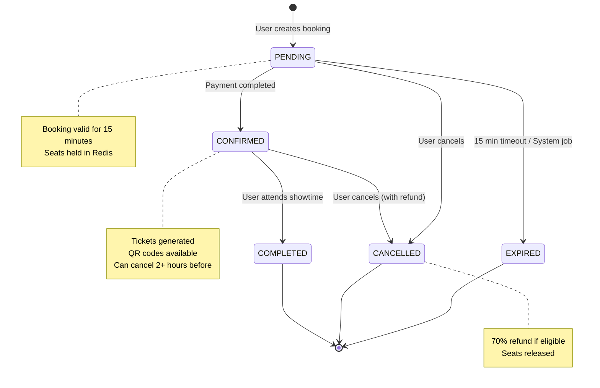
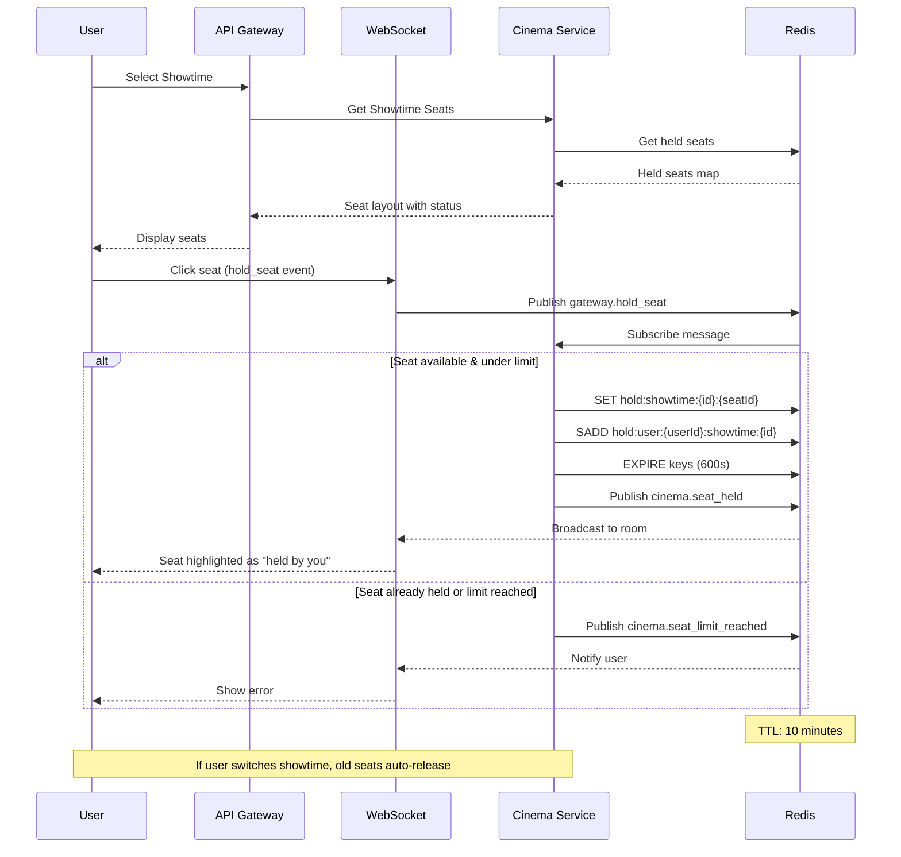
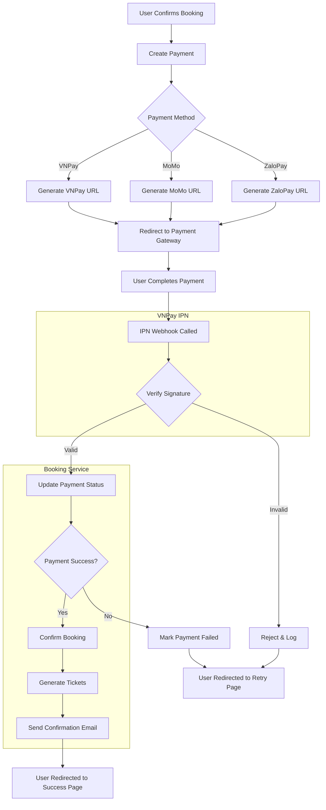
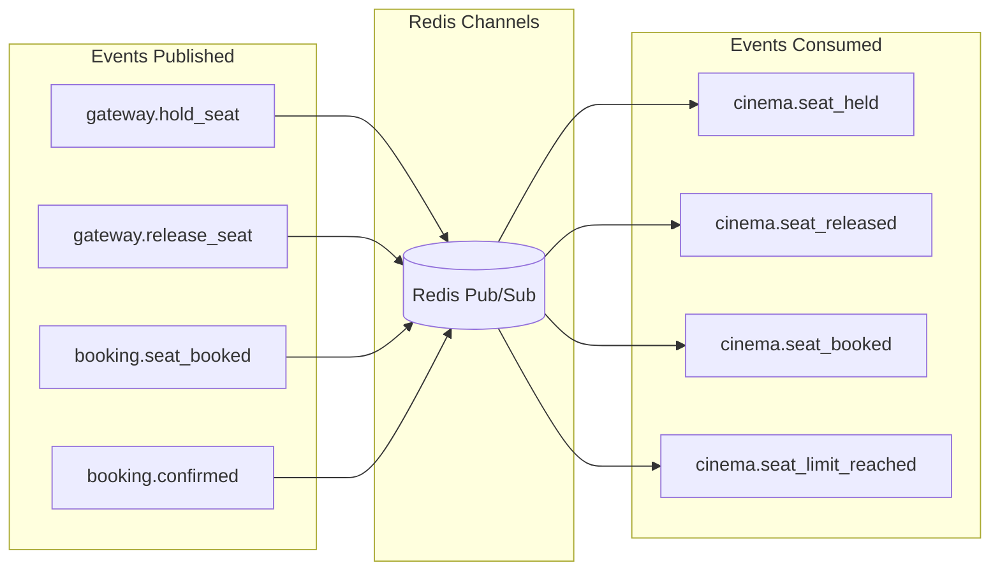
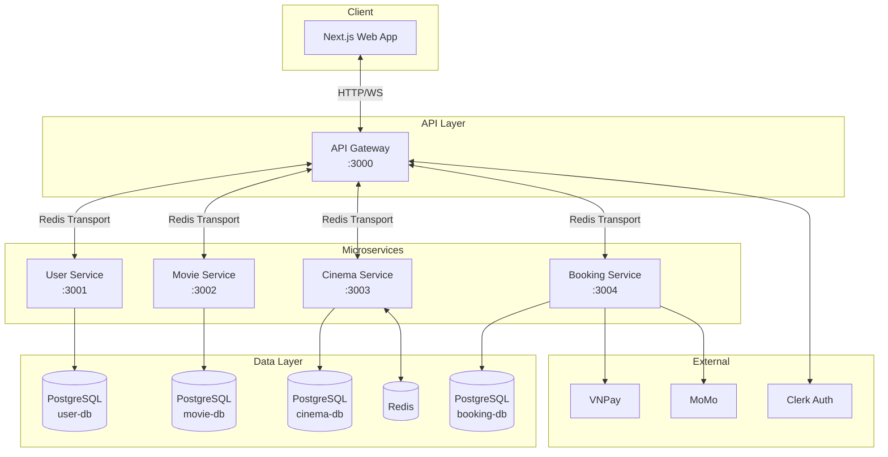

# Software Requirements Specification (SRS)

## Movie Hub - Movie Ticket Selling Platform

**Document Version:** 1.0  
**Date:** December 21, 2024  
**Project:** Movie Hub  
**Architecture:** Microservices (NX Monorepo)

---

## Table of Contents

1. [Introduction](#1-introduction)
2. [System Actors](#2-system-actors)
3. [Functional Requirements Overview](#3-functional-requirements-overview)
4. [Business Rules](#4-business-rules)
5. [Data Models Summary](#5-data-models-summary)
6. [Appendix: API Endpoints Summary](#6-appendix-api-endpoints-summary)
7. [Diagrams](#7-diagrams)

---

## 1. Introduction

### 1.1 Purpose & Scope

**Movie Hub** is a comprehensive movie ticket booking platform that enables users to:

- **Browse and search movies** currently showing or upcoming at partner cinemas
- **View cinema locations** with proximity-based search and filtering capabilities
- **Select showtimes** with real-time seat availability visualization
- **Reserve seats** through a real-time seat locking mechanism
- **Order concessions** (food and beverages) as part of the booking flow
- **Process payments** via multiple payment gateways (VNPay, MoMo, ZaloPay, etc.)
- **Earn and redeem loyalty points** across transactions
- **Receive digital tickets** with QR codes for entry validation

The platform caters to the Vietnamese cinema market with localized payment methods, age rating systems (CAVI), and Vietnamese language support.

### 1.2 Technology Stack

_Derived from `package.json` analysis:_

| Layer                   | Technology                                                      |
| ----------------------- | --------------------------------------------------------------- |
| **Backend Framework**   | NestJS v11.0.0                                                  |
| **API Gateway Pattern** | Microservices with Redis message broker                         |
| **Database**            | PostgreSQL (4 separate databases per microservice)              |
| **ORM**                 | Prisma v6.16.2                                                  |
| **Authentication**      | Clerk SDK (@clerk/clerk-sdk-node v5.1.6, @clerk/nextjs v6.33.5) |
| **Caching & Pub/Sub**   | Redis (ioredis v5.8.1, @socket.io/redis-adapter)                |
| **Real-time**           | Socket.io v4.8.1                                                |
| **Frontend**            | Next.js v15.2.4, React 19.0.0                                   |
| **UI Components**       | Radix UI, Shadcn/UI, Tailwind CSS                               |
| **State Management**    | Zustand v5.0.8, TanStack Query v5.90.2                          |
| **Validation**          | Zod v4.1.12, class-validator v0.14.2                            |
| **API Documentation**   | NestJS Swagger v11.2.0                                          |
| **Build System**        | NX Monorepo (v21.6.3)                                           |
| **QR Code Generation**  | qrcode v1.5.4                                                   |
| **Email**               | Nodemailer v7.0.10                                              |

### 1.3 Service Architecture

The platform consists of 5 microservices:

| Service           | Database           | Responsibility                                               |
| ----------------- | ------------------ | ------------------------------------------------------------ |
| `api-gateway`     | N/A                | Request routing, authentication, aggregation                 |
| `user-service`    | `postgres-user`    | User profiles, staff management, roles/permissions, settings |
| `movie-service`   | `postgres-movie`   | Movie catalog, genres, releases, reviews                     |
| `cinema-service`  | `postgres-cinema`  | Cinemas, halls, seats, showtimes, reservations, pricing      |
| `booking-service` | `postgres-booking` | Bookings, tickets, payments, refunds, promotions, loyalty    |

---

## 2. System Actors

### 2.1 Actor Definitions

| Actor ID | Actor Name                        | Description                                                          |
| -------- | --------------------------------- | -------------------------------------------------------------------- |
| **A1**   | Guest                             | Unauthenticated visitor browsing movies and cinemas                  |
| **A2**   | Member                            | Authenticated user who can book tickets and manage their profile     |
| **A3**   | Cinema Staff                      | Staff members responsible for ticket validation and concession sales |
| **A4**   | Cinema Manager (Quản lý rạp phim) | Manager responsible for specific cinema operations                   |
| **A5**   | Admin                             | System administrator with full platform control                      |
| **A6**   | System/Jobs                       | Automated processes (seat expiry, booking cleanup, etc.)             |

### 2.2 Staff Positions (Vietnamese)

_Derived from `user-service/prisma/schema.prisma`:_

| Position Code       | Vietnamese                                         | English           |
| ------------------- | -------------------------------------------------- | ----------------- |
| `CINEMA_MANAGER`    | Quản lý rạp phim                                   | Cinema Manager    |
| `ASSISTANT_MANAGER` | Phó / trợ lý quản lý rạp                           | Assistant Manager |
| `TICKET_CLERK`      | Nhân viên bán vé                                   | Ticket Clerk      |
| `CONCESSION_STAFF`  | Nhân viên quầy bắp nước / đồ ăn                    | Concession Staff  |
| `USHER`             | Nhân viên soát vé, hướng dẫn khách vào phòng chiếu | Usher             |
| `PROJECTIONIST`     | Nhân viên vận hành máy chiếu                       | Projectionist     |
| `CLEANER`           | Nhân viên vệ sinh                                  | Cleaner           |
| `SECURITY`          | Nhân viên bảo vệ                                   | Security          |

### 2.3 Role Hierarchy

```
Admin
  │
  ├── Cinema Manager
  │     └── Assistant Manager
  │           ├── Ticket Clerk
  │           ├── Concession Staff
  │           ├── Usher
  │           └── Security
  │
  └── System/Jobs
```

---

## 3. Functional Requirements Overview

### 3.1 User Management Module

_Source: `api-gateway/src/app/module/user/`, `user-service/`_

| ID    | Function Name       | Trigger/API Endpoint | Actor                 |
| ----- | ------------------- | -------------------- | --------------------- |
| UM-01 | User Authentication | External (Clerk)     | Guest, Member         |
| UM-02 | List Users          | `GET /users`         | Admin                 |
| UM-03 | Get User Profile    | Clerk Webhook        | Member                |
| UM-04 | Create Staff        | `POST /v1/staffs`    | Admin, Cinema Manager |
| UM-05 | List Staff          | `GET /v1/staffs`     | Admin, Cinema Manager |
| UM-06 | Get Staff Details   | `GET /v1/staffs/:id` | Admin, Cinema Manager |
| UM-07 | Update Staff        | `PUT /v1/staffs/:id` | Admin, Cinema Manager |

**Staff Query Parameters:**

- `cinemaId`: Filter by cinema location
- `position`: Filter by staff position (StaffPosition enum)
- `status`: Filter by status (ACTIVE/INACTIVE)

### 3.2 Cinema & Hall Management Module

_Source: `api-gateway/src/app/module/cinema/`, `cinema-service/`_

#### 3.2.1 Cinema Management

| ID    | Function Name           | Trigger/API Endpoint                  | Actor         |
| ----- | ----------------------- | ------------------------------------- | ------------- |
| CM-01 | List All Cinemas        | `GET /v1/cinemas`                     | Guest, Member |
| CM-02 | Create Cinema           | `POST /v1/cinemas/cinema`             | Admin         |
| CM-03 | Update Cinema           | `PATCH /v1/cinemas/cinema/:cinemaId`  | Admin         |
| CM-04 | Delete Cinema           | `DELETE /v1/cinemas/cinema/:cinemaId` | Admin         |
| CM-05 | Get Cinema Detail       | `GET /v1/cinemas/:id`                 | Guest, Member |
| CM-06 | Search Cinemas Nearby   | `GET /v1/cinemas/nearby`              | Guest, Member |
| CM-07 | Search Cinemas by Query | `GET /v1/cinemas/search`              | Guest, Member |
| CM-08 | Filter Cinemas          | `GET /v1/cinemas/filters`             | Guest, Member |
| CM-09 | Get Available Cities    | `GET /v1/cinemas/locations/cities`    | Guest, Member |
| CM-10 | Get Available Districts | `GET /v1/cinemas/locations/districts` | Guest, Member |

#### 3.2.2 Hall Management

| ID    | Function Name       | Trigger/API Endpoint                  | Actor         |
| ----- | ------------------- | ------------------------------------- | ------------- |
| HM-01 | Get Hall by ID      | `GET /v1/halls/hall/:hallId`          | Member, Admin |
| HM-02 | Get Halls of Cinema | `GET /v1/halls/cinema/:cinemaId`      | Member, Admin |
| HM-03 | Create Hall         | `POST /v1/halls/hall`                 | Admin         |
| HM-04 | Update Hall         | `PATCH /v1/halls/hall/:hallId`        | Admin         |
| HM-05 | Delete Hall         | `DELETE /v1/halls/hall/:hallId`       | Admin         |
| HM-06 | Update Seat Status  | `PATCH /v1/halls/seat/:seatId/status` | Admin         |

#### 3.2.3 Ticket Pricing Management

| ID    | Function Name         | Trigger/API Endpoint                           | Actor |
| ----- | --------------------- | ---------------------------------------------- | ----- |
| TP-01 | Get Pricing for Hall  | `GET /v1/ticket-pricings/hall/:hallId`         | Admin |
| TP-02 | Update Ticket Pricing | `PATCH /v1/ticket-pricings/pricing/:pricingId` | Admin |

### 3.3 Movie Management Module

_Source: `api-gateway/src/app/module/movie/`, `movie-service/`_

#### 3.3.1 Movie Catalog

| ID    | Function Name      | Trigger/API Endpoint          | Actor         |
| ----- | ------------------ | ----------------------------- | ------------- |
| MV-01 | List Movies        | `GET /v1/movies`              | Guest, Member |
| MV-02 | Get Movie Details  | `GET /v1/movies/:id`          | Guest, Member |
| MV-03 | Get Movie Releases | `GET /v1/movies/:id/releases` | Guest, Member |
| MV-04 | Create Movie       | `POST /v1/movies`             | Admin         |
| MV-05 | Update Movie       | `PUT /v1/movies/:id`          | Admin         |
| MV-06 | Delete Movie       | `DELETE /v1/movies/:id`       | Admin         |

#### 3.3.2 Movie Releases

| ID    | Function Name        | Trigger/API Endpoint            | Actor |
| ----- | -------------------- | ------------------------------- | ----- |
| MR-01 | Create Movie Release | `POST /v1/movie-releases`       | Admin |
| MR-02 | Update Movie Release | `PUT /v1/movie-releases/:id`    | Admin |
| MR-03 | Delete Movie Release | `DELETE /v1/movie-releases/:id` | Admin |

#### 3.3.3 Genre Management

| ID    | Function Name   | Trigger/API Endpoint    | Actor         |
| ----- | --------------- | ----------------------- | ------------- |
| GM-01 | List All Genres | `GET /v1/genres`        | Guest, Member |
| GM-02 | Get Genre by ID | `GET /v1/genres/:id`    | Guest, Member |
| GM-03 | Create Genre    | `POST /v1/genres`       | Admin         |
| GM-04 | Update Genre    | `PUT /v1/genres/:id`    | Admin         |
| GM-05 | Delete Genre    | `DELETE /v1/genres/:id` | Admin         |

#### 3.3.4 Movie Reviews

| ID    | Function Name     | Trigger/API Endpoint                   | Actor         |
| ----- | ----------------- | -------------------------------------- | ------------- |
| RV-01 | List Reviews      | `GET /v1/reviews`                      | Guest, Member |
| RV-02 | Get Movie Reviews | `GET /v1/movies/:id/reviews`           | Guest, Member |
| RV-03 | Create Review     | `POST /v1/movies/:id/reviews`          | Member        |
| RV-04 | Update Review     | `PUT /v1/movies/:id/reviews/:reviewId` | Member        |
| RV-05 | Delete Review     | `DELETE /v1/reviews/:id`               | Admin         |

### 3.4 Showtime Scheduling Module

_Source: `api-gateway/src/app/module/cinema/controller/showtime.controller.ts`_

| ID    | Function Name                 | Trigger/API Endpoint                                        | Actor         |
| ----- | ----------------------------- | ----------------------------------------------------------- | ------------- |
| ST-01 | Get Showtime Seats            | `GET /v1/showtimes/:id/seats`                               | Member        |
| ST-02 | Get Session TTL               | `GET /v1/showtimes/showtime/:showtimeId/ttl`                | Member        |
| ST-03 | Create Showtime               | `POST /v1/showtimes/showtime`                               | Admin         |
| ST-04 | Create Batch Showtimes        | `POST /v1/showtimes/batch`                                  | Admin         |
| ST-05 | Update Showtime               | `PATCH /v1/showtimes/showtime/:id`                          | Admin         |
| ST-06 | Delete Showtime               | `DELETE /v1/showtimes/showtime/:id`                         | Admin         |
| ST-07 | Get Movie Showtimes at Cinema | `GET /v1/cinemas/:cinemaId/movies/:movieId/showtimes`       | Guest, Member |
| ST-08 | Admin Get Showtimes           | `GET /v1/cinemas/:cinemaId/movies/:movieId/showtimes/admin` | Admin         |
| ST-09 | Get Movies at Cinema          | `GET /v1/cinemas/cinema/:cinemaId/movies`                   | Guest, Member |
| ST-10 | Get All Movies with Showtimes | `GET /v1/cinemas/movies/showtimes`                          | Guest, Member |

### 3.5 Booking & Seat Selection Module

_Source: `api-gateway/src/app/module/booking/controller/booking.controller.ts`, `booking-service/src/app/booking/booking.service.ts`, `cinema-service/src/app/realtime/realtime.service.ts`_

#### 3.5.1 User Booking Operations

| ID    | Function Name                  | Trigger/API Endpoint                          | Actor         |
| ----- | ------------------------------ | --------------------------------------------- | ------------- |
| BK-01 | Create Booking                 | `POST /v1/bookings`                           | Member        |
| BK-02 | List User Bookings             | `GET /v1/bookings`                            | Member        |
| BK-03 | Get Booking Details            | `GET /v1/bookings/:id`                        | Member        |
| BK-04 | Get Booking Summary            | `GET /v1/bookings/:id/summary`                | Member        |
| BK-05 | Cancel Booking                 | `POST /v1/bookings/:id/cancel`                | Member        |
| BK-06 | Update Booking                 | `PUT /v1/bookings/:id`                        | Member        |
| BK-07 | Reschedule Booking             | `POST /v1/bookings/:id/reschedule`            | Member        |
| BK-08 | Calculate Refund               | `GET /v1/bookings/:id/refund-calculation`     | Member        |
| BK-09 | Cancel with Refund             | `POST /v1/bookings/:id/cancel-with-refund`    | Member        |
| BK-10 | Check User Booking at Showtime | `GET /v1/bookings/showtime/:showtimeId/check` | Member        |
| BK-11 | Get Cancellation Policy        | `GET /v1/bookings/cancellation-policy`        | Guest, Member |

#### 3.5.2 Admin Booking Operations

| ID     | Function Name               | Trigger/API Endpoint                          | Actor |
| ------ | --------------------------- | --------------------------------------------- | ----- |
| BK-A01 | Admin List All Bookings     | `GET /v1/bookings/admin/all`                  | Admin |
| BK-A02 | Find Bookings by Showtime   | `GET /v1/bookings/admin/showtime/:showtimeId` | Admin |
| BK-A03 | Find Bookings by Date Range | `GET /v1/bookings/admin/date-range`           | Admin |
| BK-A04 | Update Booking Status       | `PUT /v1/bookings/admin/:id/status`           | Admin |
| BK-A05 | Confirm Booking             | `POST /v1/bookings/admin/:id/confirm`         | Admin |
| BK-A06 | Complete Booking            | `POST /v1/bookings/admin/:id/complete`        | Admin |
| BK-A07 | Expire Booking              | `POST /v1/bookings/admin/:id/expire`          | Admin |
| BK-A08 | Get Booking Statistics      | `GET /v1/bookings/admin/statistics`           | Admin |
| BK-A09 | Get Revenue Report          | `GET /v1/bookings/admin/revenue-report`       | Admin |

#### 3.5.3 Real-time Seat Selection

_Source: `cinema-service/src/app/realtime/realtime.service.ts`_

| ID    | Function Name              | Trigger/Channel                        | Actor  |
| ----- | -------------------------- | -------------------------------------- | ------ |
| RT-01 | Hold Seat                  | `gateway.hold_seat` (Redis Pub/Sub)    | Member |
| RT-02 | Release Seat               | `gateway.release_seat` (Redis Pub/Sub) | Member |
| RT-03 | Confirm Seat Booked        | `booking.seat_booked` (Redis Pub/Sub)  | System |
| RT-04 | Clear Old Showtime Session | Internal (on showtime switch)          | System |
| RT-05 | Get All Held Seats         | Internal API                           | System |
| RT-06 | Get User Held Seats        | Internal API                           | System |

### 3.6 Payment & Transaction Module

_Source: `api-gateway/src/app/module/booking/controller/payment.controller.ts`_

| ID     | Function Name           | Trigger/API Endpoint                    | Actor          |
| ------ | ----------------------- | --------------------------------------- | -------------- |
| PY-01  | Create Payment          | `POST /v1/payments/bookings/:bookingId` | Member         |
| PY-02  | Get Payment Details     | `GET /v1/payments/:id`                  | Member         |
| PY-03  | Get Payments by Booking | `GET /v1/payments/booking/:bookingId`   | Member         |
| PY-04  | VNPay IPN Webhook       | `GET /v1/payments/vnpay/ipn`            | System (VNPay) |
| PY-05  | VNPay Return URL        | `GET /v1/payments/vnpay/return`         | Member         |
| PY-A01 | Admin List All Payments | `GET /v1/payments/admin/all`            | Admin          |
| PY-A02 | Find Payments by Status | `GET /v1/payments/admin/status/:status` | Admin          |
| PY-A03 | Cancel Payment          | `PUT /v1/payments/admin/:id/cancel`     | Admin          |
| PY-A04 | Get Payment Statistics  | `GET /v1/payments/admin/statistics`     | Admin          |

### 3.7 Ticket Management Module

_Source: `api-gateway/src/app/module/booking/controller/ticket.controller.ts`_

| ID     | Function Name            | Trigger/API Endpoint                         | Actor         |
| ------ | ------------------------ | -------------------------------------------- | ------------- |
| TK-01  | Get Ticket Details       | `GET /v1/tickets/:id`                        | Member        |
| TK-02  | Find Ticket by Code      | `GET /v1/tickets/code/:ticketCode`           | Member, Staff |
| TK-03  | Validate Ticket          | `POST /v1/tickets/:id/validate`              | Staff         |
| TK-04  | Use Ticket (Mark Entry)  | `POST /v1/tickets/:id/use`                   | Staff         |
| TK-05  | Generate QR Code         | `GET /v1/tickets/:id/qr`                     | Member        |
| TK-A01 | Admin List All Tickets   | `GET /v1/tickets/admin/all`                  | Admin         |
| TK-A02 | Find Tickets by Showtime | `GET /v1/tickets/admin/showtime/:showtimeId` | Admin         |
| TK-A03 | Find Tickets by Booking  | `GET /v1/tickets/admin/booking/:bookingId`   | Admin         |
| TK-A04 | Bulk Validate Tickets    | `POST /v1/tickets/admin/bulk-validate`       | Admin         |
| TK-A05 | Cancel Ticket            | `PUT /v1/tickets/admin/:id/cancel`           | Admin         |

### 3.8 Refund Management Module

_Source: `api-gateway/src/app/module/booking/controller/refund.controller.ts`_

| ID    | Function Name           | Trigger/API Endpoint                 | Actor  |
| ----- | ----------------------- | ------------------------------------ | ------ |
| RF-01 | Create Refund Request   | `POST /v1/refunds`                   | Member |
| RF-02 | List Refunds            | `GET /v1/refunds`                    | Admin  |
| RF-03 | Get Refund Details      | `GET /v1/refunds/:id`                | Admin  |
| RF-04 | Find Refunds by Payment | `GET /v1/refunds/payment/:paymentId` | Admin  |
| RF-05 | Process Refund          | `PUT /v1/refunds/:id/process`        | Admin  |
| RF-06 | Approve Refund          | `PUT /v1/refunds/:id/approve`        | Admin  |
| RF-07 | Reject Refund           | `PUT /v1/refunds/:id/reject`         | Admin  |

### 3.9 Concessions/F&B Module

_Source: `api-gateway/src/app/module/booking/controller/concession.controller.ts`_

| ID    | Function Name          | Trigger/API Endpoint                  | Actor         |
| ----- | ---------------------- | ------------------------------------- | ------------- |
| CS-01 | List Concessions       | `GET /v1/concessions`                 | Guest, Member |
| CS-02 | Get Concession Details | `GET /v1/concessions/:id`             | Guest, Member |
| CS-03 | Create Concession      | `POST /v1/concessions`                | Admin         |
| CS-04 | Update Concession      | `PUT /v1/concessions/:id`             | Admin         |
| CS-05 | Delete Concession      | `DELETE /v1/concessions/:id`          | Admin         |
| CS-06 | Update Inventory       | `PATCH /v1/concessions/:id/inventory` | Admin         |

### 3.10 Promotions & Discounts Module

_Source: `api-gateway/src/app/module/booking/controller/promotion.controller.ts`_

| ID    | Function Name           | Trigger/API Endpoint                     | Actor         |
| ----- | ----------------------- | ---------------------------------------- | ------------- |
| PM-01 | List Promotions         | `GET /v1/promotions`                     | Guest, Member |
| PM-02 | Get Promotion Details   | `GET /v1/promotions/:id`                 | Guest, Member |
| PM-03 | Find Promotion by Code  | `GET /v1/promotions/code/:code`          | Member        |
| PM-04 | Validate Promotion Code | `POST /v1/promotions/validate/:code`     | Member        |
| PM-05 | Create Promotion        | `POST /v1/promotions`                    | Admin         |
| PM-06 | Update Promotion        | `PUT /v1/promotions/:id`                 | Admin         |
| PM-07 | Delete Promotion        | `DELETE /v1/promotions/:id`              | Admin         |
| PM-08 | Toggle Promotion Active | `PATCH /v1/promotions/:id/toggle-active` | Admin         |

### 3.11 Loyalty & Points Module

_Source: `api-gateway/src/app/module/booking/controller/loyalty.controller.ts`_

| ID    | Function Name           | Trigger/API Endpoint           | Actor          |
| ----- | ----------------------- | ------------------------------ | -------------- |
| LY-01 | Get Loyalty Balance     | `GET /v1/loyalty/balance`      | Member         |
| LY-02 | Get Transaction History | `GET /v1/loyalty/transactions` | Member         |
| LY-03 | Earn Points             | `POST /v1/loyalty/earn`        | Member, System |
| LY-04 | Redeem Points           | `POST /v1/loyalty/redeem`      | Member         |

### 3.12 System Configuration Module

_Source: `api-gateway/src/app/module/user/controller/config.controller.ts`_

| ID    | Function Name    | Trigger/API Endpoint  | Actor |
| ----- | ---------------- | --------------------- | ----- |
| CF-01 | Get All Settings | `GET /v1/config`      | Admin |
| CF-02 | Update Setting   | `PUT /v1/config/:key` | Admin |

---

## 4. Business Rules

### 4.1 Seat Reservation Rules

_Derived from `cinema-service/src/app/realtime/realtime.service.ts`:_

| Rule ID        | Rule Description                                                                                              | Source File                                     |
| -------------- | ------------------------------------------------------------------------------------------------------------- | ----------------------------------------------- |
| **BR-SEAT-01** | Maximum seats per user per showtime: **8 seats**                                                              | `realtime.service.ts` (HOLD_LIMIT = 8)          |
| **BR-SEAT-02** | Seat hold duration (TTL): **10 minutes (600 seconds)**                                                        | `realtime.service.ts` (HOLD_TTL = 600)          |
| **BR-SEAT-03** | When a user selects a new showtime, all previously held seats from other showtimes are automatically released | `realtime.service.ts` (clearOldShowtimeSession) |
| **BR-SEAT-04** | A seat cannot be held if it is already held by another user                                                   | `realtime.service.ts` (exists check)            |
| **BR-SEAT-05** | When seat limit is reached, system publishes `cinema.seat_limit_reached` event                                | `realtime.service.ts`                           |

### 4.2 Booking Rules

_Derived from `booking-service/src/app/booking/booking.service.ts`:_

| Rule ID        | Rule Description                                                   | Source File                                          |
| -------------- | ------------------------------------------------------------------ | ---------------------------------------------------- |
| **BR-BOOK-01** | Booking expiry time: **15 minutes** from creation                  | `booking.service.ts` (expiresAt = 15 _ 60 _ 1000)    |
| **BR-BOOK-02** | Only one pending booking per user per showtime is allowed          | `booking.service.ts` (existingPendingBooking check)  |
| **BR-BOOK-03** | Bookings can only be cancelled when status is PENDING or CONFIRMED | `booking.service.ts`                                 |
| **BR-BOOK-04** | Maximum reschedules per booking: **1**                             | `booking.service.ts` (MAX_RESCHEDULES = 1)           |
| **BR-BOOK-05** | Cancellation must be made at least **2 hours** before showtime     | `booking.service.ts` (CANCELLATION_HOURS_BEFORE = 2) |
| **BR-BOOK-06** | Refund percentage on ticket cancellation: **70%**                  | `booking.service.ts` (REFUND_PERCENTAGE = 70)        |

### 4.3 Promotion Rules

_Derived from `booking-service/src/app/booking/booking.service.ts`:_

| Rule ID         | Rule Description                                                   | Source File          |
| --------------- | ------------------------------------------------------------------ | -------------------- |
| **BR-PROMO-01** | Promotion must be within valid date range (valid_from to valid_to) | `booking.service.ts` |
| **BR-PROMO-02** | Promotion usage limit is enforced per promotion                    | `booking.service.ts` |
| **BR-PROMO-03** | Minimum purchase amount is validated before applying promotion     | `booking.service.ts` |
| **BR-PROMO-04** | For PERCENTAGE type promotions, max_discount cap is applied        | `booking.service.ts` |
| **BR-PROMO-05** | Discount cannot exceed the subtotal amount                         | `booking.service.ts` |

### 4.4 Loyalty Points Rules

_Derived from `booking-service/src/app/booking/booking.service.ts`:_

| Rule ID           | Rule Description                                           | Source File              |
| ----------------- | ---------------------------------------------------------- | ------------------------ |
| **BR-LOYALTY-01** | Point redemption rate: **1 point = 1,000 VND**             | `booking.service.ts`     |
| **BR-LOYALTY-02** | Point earning rate: **1 point per 1,000 VND spent**        | `booking.service.ts`     |
| **BR-LOYALTY-03** | Users cannot redeem more points than their current balance | `booking.service.ts`     |
| **BR-LOYALTY-04** | New loyalty accounts start at BRONZE tier                  | Schema (default: BRONZE) |

### 4.5 Payment Rules

| Rule ID       | Rule Description                                                           | Source File             |
| ------------- | -------------------------------------------------------------------------- | ----------------------- |
| **BR-PAY-01** | VNPay IPN webhook is unauthenticated (public endpoint)                     | `payment.controller.ts` |
| **BR-PAY-02** | VNPay IPN must return exact format: `{ RspCode: string, Message: string }` | `payment.controller.ts` |
| **BR-PAY-03** | VAT rate: **10%** on all transactions                                      | `booking.service.ts`    |

### 4.6 Movie Review Rules

_Derived from `movie-service/prisma/schema.prisma`:_

| Rule ID          | Rule Description                              | Source File                          |
| ---------------- | --------------------------------------------- | ------------------------------------ |
| **BR-REVIEW-01** | One user can only submit one review per movie | Schema (@@unique([movieId, userId])) |
| **BR-REVIEW-02** | Rating scale: **1 to 5**                      | Schema (rating Int)                  |

### 4.7 Cinema Review Rules

_Derived from `cinema-service/prisma/schema.prisma`:_

| Rule ID        | Rule Description                               | Source File                             |
| -------------- | ---------------------------------------------- | --------------------------------------- |
| **BR-CREV-01** | One user can only submit one review per cinema | Schema (@@unique([cinema_id, user_id])) |
| **BR-CREV-02** | Reviews can be marked as "verified visit"      | Schema (verified_visit Boolean)         |

---

## 5. Data Models Summary

### 5.1 Core Entities

#### User Service Entities

_Source: `user-service/prisma/schema.prisma`_

| Entity             | Description                                  |
| ------------------ | -------------------------------------------- |
| **Role**           | System roles for authorization               |
| **Permission**     | Individual permissions assigned to roles     |
| **UserRole**       | Junction table linking users to roles        |
| **RolePermission** | Junction table linking roles to permissions  |
| **Staff**          | Cinema staff members with employment details |
| **Setting**        | System-wide configuration key-value pairs    |

#### Movie Service Entities

_Source: `movie-service/prisma/schema.prisma`_

| Entity           | Description                                                     |
| ---------------- | --------------------------------------------------------------- |
| **Movie**        | Core movie information (title, overview, poster, runtime, etc.) |
| **MovieRelease** | Release periods for movies                                      |
| **Genre**        | Movie genre categories                                          |
| **MovieGenre**   | Junction table linking movies to genres                         |
| **Review**       | User reviews and ratings for movies                             |

#### Cinema Service Entities

_Source: `cinema-service/prisma/schema.prisma`_

| Entity               | Description                                         |
| -------------------- | --------------------------------------------------- |
| **Cinemas**          | Cinema locations with amenities and operating hours |
| **Halls**            | Screening rooms within cinemas                      |
| **Seats**            | Individual seat configurations within halls         |
| **TicketPricing**    | Dynamic pricing by seat type and day type           |
| **Showtimes**        | Movie scheduling in specific halls                  |
| **SeatReservations** | Seat reservation records per showtime               |
| **CinemaReviews**    | User reviews for cinema locations                   |

#### Booking Service Entities

_Source: `booking-service/prisma/schema.prisma`_

| Entity                  | Description                                 |
| ----------------------- | ------------------------------------------- |
| **Bookings**            | Main booking transaction records            |
| **Tickets**             | Individual tickets within a booking         |
| **Payments**            | Payment transaction records                 |
| **Refunds**             | Refund requests and processing              |
| **Concessions**         | Food and beverage items                     |
| **BookingConcessions**  | Junction table for bookings and concessions |
| **Promotions**          | Discount codes and promotional offers       |
| **LoyaltyAccounts**     | User loyalty program accounts               |
| **LoyaltyTransactions** | Points earning and redemption history       |

### 5.2 Enumerations

#### Booking Service Enums

| Enum Name                  | Values                                                                           | Description                |
| -------------------------- | -------------------------------------------------------------------------------- | -------------------------- |
| **BookingStatus**          | `PENDING`, `CONFIRMED`, `CANCELLED`, `EXPIRED`, `COMPLETED`                      | Booking lifecycle states   |
| **PaymentStatus**          | `PENDING`, `PROCESSING`, `COMPLETED`, `FAILED`, `REFUNDED`                       | Payment processing states  |
| **PaymentMethod**          | `CREDIT_CARD`, `DEBIT_CARD`, `MOMO`, `ZALOPAY`, `VNPAY`, `BANK_TRANSFER`, `CASH` | Supported payment methods  |
| **TicketStatus**           | `VALID`, `USED`, `CANCELLED`, `EXPIRED`                                          | Ticket validity states     |
| **RefundStatus**           | `PENDING`, `PROCESSING`, `COMPLETED`, `FAILED`                                   | Refund processing states   |
| **ConcessionCategory**     | `FOOD`, `DRINK`, `COMBO`, `MERCHANDISE`                                          | F&B item categories        |
| **PromotionType**          | `PERCENTAGE`, `FIXED_AMOUNT`, `FREE_ITEM`, `POINTS`                              | Discount calculation types |
| **LoyaltyTransactionType** | `EARN`, `REDEEM`, `EXPIRE`                                                       | Points transaction types   |
| **LoyaltyTier**            | `BRONZE`, `SILVER`, `GOLD`, `PLATINUM`                                           | Loyalty membership tiers   |

#### Cinema Service Enums

| Enum Name             | Values                                                       | Description                   |
| --------------------- | ------------------------------------------------------------ | ----------------------------- |
| **CinemaStatus**      | `ACTIVE`, `MAINTENANCE`, `CLOSED`                            | Cinema operational states     |
| **HallType**          | `STANDARD`, `VIP`, `IMAX`, `FOUR_DX`, `PREMIUM`              | Hall/screen types             |
| **HallStatus**        | `ACTIVE`, `MAINTENANCE`, `CLOSED`                            | Hall operational states       |
| **LayoutType**        | `STANDARD`, `DUAL_AISLE`, `STADIUM`                          | Seating layout configurations |
| **SeatType**          | `STANDARD`, `VIP`, `COUPLE`, `PREMIUM`, `WHEELCHAIR`         | Seat categories               |
| **SeatStatus**        | `ACTIVE`, `BROKEN`, `MAINTENANCE`                            | Seat condition states         |
| **DayType**           | `WEEKDAY`, `WEEKEND`, `HOLIDAY`                              | Pricing day categories        |
| **Format**            | `TWO_D`, `THREE_D`, `IMAX`, `FOUR_DX`                        | Movie screening formats       |
| **ShowtimeStatus**    | `SCHEDULED`, `SELLING`, `SOLD_OUT`, `CANCELLED`, `COMPLETED` | Showtime states               |
| **ReservationStatus** | `CONFIRMED`, `CANCELLED`                                     | Seat reservation states       |
| **ReviewStatus**      | `ACTIVE`, `HIDDEN`, `DELETED`                                | Review visibility states      |

#### Movie Service Enums

| Enum Name          | Values                                | Description                 |
| ------------------ | ------------------------------------- | --------------------------- |
| **AgeRating**      | `P`, `K`, `T13`, `T16`, `T18`, `C`    | Vietnamese CAVI age ratings |
| **LanguageOption** | `ORIGINAL`, `SUBTITLE`, `DUBBED`      | Audio/subtitle options      |
| **Format**         | `TWO_D`, `THREE_D`, `IMAX`, `FOUR_DX` | Movie formats               |

#### User Service Enums

| Enum Name         | Values                                                                                                                     | Description             |
| ----------------- | -------------------------------------------------------------------------------------------------------------------------- | ----------------------- |
| **Gender**        | `MALE`, `FEMALE`, `OTHER`                                                                                                  | Staff gender options    |
| **StaffStatus**   | `ACTIVE`, `INACTIVE`                                                                                                       | Staff employment status |
| **WorkType**      | `FULL_TIME`, `PART_TIME`, `CONTRACT`                                                                                       | Employment types        |
| **StaffPosition** | `CINEMA_MANAGER`, `ASSISTANT_MANAGER`, `TICKET_CLERK`, `CONCESSION_STAFF`, `USHER`, `PROJECTIONIST`, `CLEANER`, `SECURITY` | Staff job positions     |
| **ShiftType**     | `MORNING`, `AFTERNOON`, `NIGHT`                                                                                            | Work shift assignments  |

---

## 6. Appendix: API Endpoints Summary

### 6.1 Authentication

All protected endpoints require Clerk authentication via `ClerkAuthGuard`.

### 6.2 Version Prefix

All API endpoints use version prefix: `/v1/`

### 6.3 Complete Endpoint Table

| HTTP Method        | Endpoint                                                | Auth Required | Description                       |
| ------------------ | ------------------------------------------------------- | ------------- | --------------------------------- |
| **Users & Staff**  |                                                         |               |                                   |
| GET                | `/users`                                                | Yes (Admin)   | List all users                    |
| POST               | `/v1/staffs`                                            | Yes           | Create staff member               |
| GET                | `/v1/staffs`                                            | Yes           | List staff members                |
| GET                | `/v1/staffs/:id`                                        | Yes           | Get staff details                 |
| PUT                | `/v1/staffs/:id`                                        | Yes           | Update staff member               |
| **Configuration**  |                                                         |               |                                   |
| GET                | `/v1/config`                                            | Yes           | Get all settings                  |
| PUT                | `/v1/config/:key`                                       | Yes           | Update setting                    |
| **Cinemas**        |                                                         |               |                                   |
| GET                | `/v1/cinemas`                                           | No            | List all cinemas                  |
| POST               | `/v1/cinemas/cinema`                                    | Yes           | Create cinema                     |
| PATCH              | `/v1/cinemas/cinema/:cinemaId`                          | Yes           | Update cinema                     |
| DELETE             | `/v1/cinemas/cinema/:cinemaId`                          | Yes           | Delete cinema                     |
| GET                | `/v1/cinemas/:id`                                       | No            | Get cinema detail                 |
| GET                | `/v1/cinemas/nearby`                                    | No            | Search cinemas nearby             |
| GET                | `/v1/cinemas/search`                                    | No            | Search cinemas by query           |
| GET                | `/v1/cinemas/filters`                                   | No            | Filter cinemas                    |
| GET                | `/v1/cinemas/locations/cities`                          | No            | Get available cities              |
| GET                | `/v1/cinemas/locations/districts`                       | No            | Get available districts           |
| GET                | `/v1/cinemas/:cinemaId/movies/:movieId/showtimes`       | No            | Get showtimes for movie at cinema |
| GET                | `/v1/cinemas/:cinemaId/movies/:movieId/showtimes/admin` | Yes           | Admin get showtimes               |
| GET                | `/v1/cinemas/cinema/:cinemaId/movies`                   | No            | Get movies at cinema              |
| GET                | `/v1/cinemas/movies/showtimes`                          | No            | Get all movies with showtimes     |
| **Halls**          |                                                         |               |                                   |
| GET                | `/v1/halls/hall/:hallId`                                | Yes           | Get hall by ID                    |
| GET                | `/v1/halls/cinema/:cinemaId`                            | Yes           | Get halls of cinema               |
| POST               | `/v1/halls/hall`                                        | Yes           | Create hall                       |
| PATCH              | `/v1/halls/hall/:hallId`                                | Yes           | Update hall                       |
| DELETE             | `/v1/halls/hall/:hallId`                                | Yes           | Delete hall                       |
| PATCH              | `/v1/halls/seat/:seatId/status`                         | Yes           | Update seat status                |
| **Ticket Pricing** |                                                         |               |                                   |
| GET                | `/v1/ticket-pricings/hall/:hallId`                      | Yes           | Get pricing for hall              |
| PATCH              | `/v1/ticket-pricings/pricing/:pricingId`                | Yes           | Update pricing                    |
| **Showtimes**      |                                                         |               |                                   |
| GET                | `/v1/showtimes`                                         | Yes           | Test endpoint                     |
| GET                | `/v1/showtimes/:id/seats`                               | Yes           | Get showtime seats                |
| GET                | `/v1/showtimes/showtime/:showtimeId/ttl`                | Yes           | Get session TTL                   |
| POST               | `/v1/showtimes/showtime`                                | Yes           | Create showtime                   |
| POST               | `/v1/showtimes/batch`                                   | Yes           | Create batch showtimes            |
| PATCH              | `/v1/showtimes/showtime/:id`                            | Yes           | Update showtime                   |
| DELETE             | `/v1/showtimes/showtime/:id`                            | Yes           | Delete showtime                   |
| **Movies**         |                                                         |               |                                   |
| GET                | `/v1/movies`                                            | No            | List movies                       |
| GET                | `/v1/movies/:id`                                        | No            | Get movie details                 |
| GET                | `/v1/movies/:id/releases`                               | No            | Get movie releases                |
| POST               | `/v1/movies`                                            | Yes           | Create movie                      |
| PUT                | `/v1/movies/:id`                                        | Yes           | Update movie                      |
| DELETE             | `/v1/movies/:id`                                        | Yes           | Delete movie                      |
| GET                | `/v1/movies/:id/reviews`                                | No            | Get movie reviews                 |
| POST               | `/v1/movies/:id/reviews`                                | Yes           | Create review                     |
| PUT                | `/v1/movies/:id/reviews/:reviewId`                      | Yes           | Update review                     |
| **Movie Releases** |                                                         |               |                                   |
| POST               | `/v1/movie-releases`                                    | Yes           | Create movie release              |
| PUT                | `/v1/movie-releases/:id`                                | Yes           | Update movie release              |
| DELETE             | `/v1/movie-releases/:id`                                | Yes           | Delete movie release              |
| **Genres**         |                                                         |               |                                   |
| GET                | `/v1/genres`                                            | No            | List all genres                   |
| GET                | `/v1/genres/:id`                                        | No            | Get genre by ID                   |
| POST               | `/v1/genres`                                            | Yes           | Create genre                      |
| PUT                | `/v1/genres/:id`                                        | Yes           | Update genre                      |
| DELETE             | `/v1/genres/:id`                                        | Yes           | Delete genre                      |
| **Reviews**        |                                                         |               |                                   |
| GET                | `/v1/reviews`                                           | No            | List reviews                      |
| DELETE             | `/v1/reviews/:id`                                       | Yes           | Delete review                     |
| **Bookings**       |                                                         |               |                                   |
| POST               | `/v1/bookings`                                          | Yes           | Create booking                    |
| GET                | `/v1/bookings`                                          | Yes           | List user bookings                |
| GET                | `/v1/bookings/:id`                                      | Yes           | Get booking details               |
| GET                | `/v1/bookings/:id/summary`                              | Yes           | Get booking summary               |
| POST               | `/v1/bookings/:id/cancel`                               | Yes           | Cancel booking                    |
| PUT                | `/v1/bookings/:id`                                      | Yes           | Update booking                    |
| POST               | `/v1/bookings/:id/reschedule`                           | Yes           | Reschedule booking                |
| GET                | `/v1/bookings/:id/refund-calculation`                   | Yes           | Calculate refund                  |
| POST               | `/v1/bookings/:id/cancel-with-refund`                   | Yes           | Cancel with refund                |
| GET                | `/v1/bookings/showtime/:showtimeId/check`               | Yes           | Check user booking at showtime    |
| GET                | `/v1/bookings/cancellation-policy`                      | No            | Get cancellation policy           |
| GET                | `/v1/bookings/admin/all`                                | Yes           | Admin list all bookings           |
| GET                | `/v1/bookings/admin/showtime/:showtimeId`               | Yes           | Find bookings by showtime         |
| GET                | `/v1/bookings/admin/date-range`                         | Yes           | Find bookings by date range       |
| PUT                | `/v1/bookings/admin/:id/status`                         | Yes           | Update booking status             |
| POST               | `/v1/bookings/admin/:id/confirm`                        | Yes           | Confirm booking                   |
| POST               | `/v1/bookings/admin/:id/complete`                       | Yes           | Complete booking                  |
| POST               | `/v1/bookings/admin/:id/expire`                         | Yes           | Expire booking                    |
| GET                | `/v1/bookings/admin/statistics`                         | Yes           | Get booking statistics            |
| GET                | `/v1/bookings/admin/revenue-report`                     | Yes           | Get revenue report                |
| **Payments**       |                                                         |               |                                   |
| POST               | `/v1/payments/bookings/:bookingId`                      | Yes           | Create payment                    |
| GET                | `/v1/payments/:id`                                      | Yes           | Get payment details               |
| GET                | `/v1/payments/booking/:bookingId`                       | Yes           | Get payments by booking           |
| GET                | `/v1/payments/vnpay/ipn`                                | No            | VNPay IPN webhook                 |
| GET                | `/v1/payments/vnpay/return`                             | No            | VNPay return URL                  |
| GET                | `/v1/payments/admin/all`                                | Yes           | Admin list all payments           |
| GET                | `/v1/payments/admin/status/:status`                     | Yes           | Find payments by status           |
| PUT                | `/v1/payments/admin/:id/cancel`                         | Yes           | Cancel payment                    |
| GET                | `/v1/payments/admin/statistics`                         | Yes           | Get payment statistics            |
| **Tickets**        |                                                         |               |                                   |
| GET                | `/v1/tickets/:id`                                       | Yes           | Get ticket details                |
| GET                | `/v1/tickets/code/:ticketCode`                          | Yes           | Find ticket by code               |
| POST               | `/v1/tickets/:id/validate`                              | Yes           | Validate ticket                   |
| POST               | `/v1/tickets/:id/use`                                   | Yes           | Use ticket (mark entry)           |
| GET                | `/v1/tickets/:id/qr`                                    | Yes           | Generate QR code                  |
| GET                | `/v1/tickets/admin/all`                                 | Yes           | Admin list all tickets            |
| GET                | `/v1/tickets/admin/showtime/:showtimeId`                | Yes           | Find tickets by showtime          |
| GET                | `/v1/tickets/admin/booking/:bookingId`                  | Yes           | Find tickets by booking           |
| POST               | `/v1/tickets/admin/bulk-validate`                       | Yes           | Bulk validate tickets             |
| PUT                | `/v1/tickets/admin/:id/cancel`                          | Yes           | Cancel ticket                     |
| **Refunds**        |                                                         |               |                                   |
| POST               | `/v1/refunds`                                           | Yes           | Create refund request             |
| GET                | `/v1/refunds`                                           | Yes           | List refunds                      |
| GET                | `/v1/refunds/:id`                                       | Yes           | Get refund details                |
| GET                | `/v1/refunds/payment/:paymentId`                        | Yes           | Find refunds by payment           |
| PUT                | `/v1/refunds/:id/process`                               | Yes           | Process refund                    |
| PUT                | `/v1/refunds/:id/approve`                               | Yes           | Approve refund                    |
| PUT                | `/v1/refunds/:id/reject`                                | Yes           | Reject refund                     |
| **Concessions**    |                                                         |               |                                   |
| GET                | `/v1/concessions`                                       | No            | List concessions                  |
| GET                | `/v1/concessions/:id`                                   | No            | Get concession details            |
| POST               | `/v1/concessions`                                       | Yes           | Create concession                 |
| PUT                | `/v1/concessions/:id`                                   | Yes           | Update concession                 |
| DELETE             | `/v1/concessions/:id`                                   | Yes           | Delete concession                 |
| PATCH              | `/v1/concessions/:id/inventory`                         | Yes           | Update inventory                  |
| **Promotions**     |                                                         |               |                                   |
| GET                | `/v1/promotions`                                        | No            | List promotions                   |
| GET                | `/v1/promotions/:id`                                    | No            | Get promotion details             |
| GET                | `/v1/promotions/code/:code`                             | No            | Find promotion by code            |
| POST               | `/v1/promotions/validate/:code`                         | No            | Validate promotion code           |
| POST               | `/v1/promotions`                                        | Yes           | Create promotion                  |
| PUT                | `/v1/promotions/:id`                                    | Yes           | Update promotion                  |
| DELETE             | `/v1/promotions/:id`                                    | Yes           | Delete promotion                  |
| PATCH              | `/v1/promotions/:id/toggle-active`                      | Yes           | Toggle promotion active           |
| **Loyalty**        |                                                         |               |                                   |
| GET                | `/v1/loyalty/balance`                                   | Yes           | Get loyalty balance               |
| GET                | `/v1/loyalty/transactions`                              | Yes           | Get transaction history           |
| POST               | `/v1/loyalty/earn`                                      | Yes           | Earn points                       |
| POST               | `/v1/loyalty/redeem`                                    | Yes           | Redeem points                     |

---

## 7. Diagrams

### 7.1 Booking Lifecycle State Diagram



### 7.2 Seat Reservation Flow



### 7.3 Payment Processing Flow



### 7.4 Real-time Seat Status Events



### 7.5 Microservice Communication



---

## Document Revision History

| Version | Date       | Author          | Changes                                           |
| ------- | ---------- | --------------- | ------------------------------------------------- |
| 1.0     | 2024-12-21 | System Analysis | Initial SRS based on codebase reverse engineering |

---

_This document was generated by analyzing the following source files:_

- `apps/*/prisma/schema.prisma` - Database schemas
- `apps/api-gateway/src/app/module/*/controller/*.controller.ts` - API endpoints
- `apps/*/src/app/*/*.service.ts` - Business logic
- `apps/cinema-service/src/app/realtime/realtime.service.ts` - Real-time seat reservation
- `package.json` - Technology stack
- `libs/shared-types/src/**/*.ts` - DTOs and Enums
