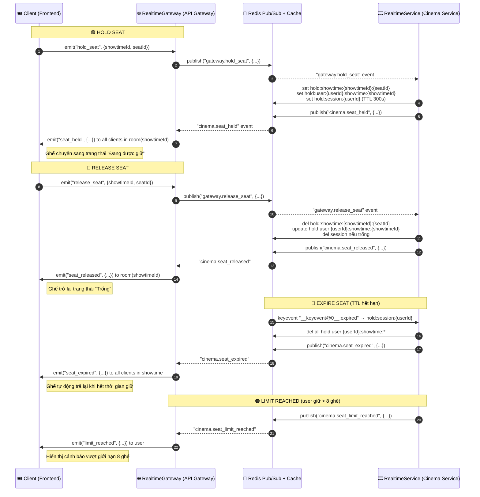

# 🎬 Seat Realtime Flow – MovieHub

## **1. Tổng quan hệ thống**
Luồng này mô phỏng quy trình **đặt ghế xem phim realtime** giữa nhiều người dùng, đảm bảo:
- Mỗi ghế chỉ được **một người giữ (hold)** tại một thời điểm.  
- Khi hết thời gian giữ, ghế được **tự động giải phóng (expire)**.  
- Tất cả client trong cùng `showtimeId` được **đồng bộ ngay lập tức** qua WebSocket.

### Thành phần chính
| Thành phần | Vai trò |
|-------------|----------|
| **Frontend** | Gửi/nhận sự kiện socket (`hold_seat`, `release_seat`, …). |
| **RealtimeGateway (API Gateway)** | Nhận socket event từ client → publish sang Redis → broadcast các sự kiện về ghế. |
| **Redis Adapter** | Đồng bộ sự kiện giữa các instance qua Redis Pub/Sub — nhận event từ một instance và broadcast lại cho tất cả client trên toàn cụm. |
| **RealtimeService (Cinema Service)** | Lắng nghe event Redis → xử lý logic lưu/giải phóng ghế trong Redis cache. |
| **Redis** | Lưu trạng thái ghế, session, và trung chuyển sự kiện giữa service. |

---

## **2. Cấu trúc Redis Cache**

| Key | Mục đích | TTL |
|------|----------|-----|
| `hold:showtime:{showtimeId}:{seatId}` | Ai đang giữ ghế nào. | 300s |
| `hold:user:{userId}:showtime:{showtimeId}` | Danh sách ghế mà user đang giữ trong suất chiếu. | 300s |
| `hold:session:{userId}` | Phiên giữ ghế của user. Nếu hết TTL → tất cả ghế sẽ tự giải phóng. | 300s |

📌 Mỗi ghế, user, và session đều có TTL đồng bộ — hết thời gian sẽ **tự động xóa** nhờ Redis Keyspace Notification.

---

## **3. Luồng hoạt động chi tiết**

### 🟢 Bước 1: Client giữ ghế (Hold Seat)
1. Frontend gửi event qua WebSocket:
   ```js
   socket.emit('hold_seat', { showtimeId, seatId });
   ```
2. `RealtimeGateway.handleHold()` nhận event:
   - Lấy `userId` từ token WebSocket.
   - Publish message sang Redis channel:
     ```
     gateway.hold_seat → { showtimeId, seatId, userId }
     ```
3. `RealtimeService` (Cinema service) nhận message qua Redis subscription:
   - Kiểm tra:
     - User còn session không (nếu chưa có → tạo `hold:session:{userId}`).
     - Ghế đã có ai giữ chưa (`hold:showtime:{showtimeId}:{seatId}`).
     - User có vượt **giới hạn 8 ghế** chưa.
   - Nếu hợp lệ:
     - Lưu key vào Redis (3 loại như trên).
     - Publish lại event:
       ```
       cinema.seat_held → { showtimeId, seatId, userId }
       ```
4. `RealtimeGateway` nhận `cinema.seat_held` → emit đến tất cả client trong `showtimeId`:
   ```ts
   server.to(showtimeId).emit('seat_held', { showtimeId, seatId, userId });
   ```
🟢 **Kết quả:** Toàn bộ người dùng trong cùng suất chiếu thấy ghế chuyển sang trạng thái “Đang được giữ”.

---

### 🔵 Bước 2: Client bỏ giữ ghế (Release Seat)
1. Client gửi:
   ```js
   socket.emit('release_seat', { showtimeId, seatId });
   ```
2. `RealtimeGateway.handleRelease()` → publish:
   ```
   gateway.release_seat → { showtimeId, seatId, userId }
   ```
3. `RealtimeService` xử lý:
   - Xóa key `hold:showtime:{showtimeId}:{seatId}`.
   - Xóa khỏi set `hold:user:{userId}:showtime:{showtimeId}`.
   - Nếu không còn ghế nào → xóa `hold:session:{userId}`.
   - Publish:
     ```
     cinema.seat_released → { showtimeId, seatId, userId }
     ```
4. `RealtimeGateway` broadcast đến tất cả client:
   ```ts
   server.to(showtimeId).emit('seat_released', { showtimeId, seatId, userId });
   ```

---

### 🔴 Bước 3: Hết thời gian giữ ghế (Expire)
1. Redis TTL cho `hold:session:{userId}` hết hạn → phát sự kiện keyspace:
   ```
   __keyevent@0__:expired → hold:session:{userId}
   ```
2. `RealtimeService` đã đăng ký `psubscribe` vào pattern này → chạy:
   - Lấy tất cả `hold:user:{userId}:showtime:*`.
   - Xóa toàn bộ ghế mà user giữ.
   - Publish event:
     ```
     cinema.seat_expired → { showtimeId, seatIds, userId }
     ```
3. `RealtimeGateway` nhận event và broadcast:
   ```ts
   server.to(showtimeId).emit('seat_expired', { showtimeId, seatIds, userId });
   ```
🔴 **Kết quả:** Ghế được tự động trả lại khi người dùng không thao tác trong 10 phút.

---

### 🟠 Bước 4: Vượt giới hạn ghế (Limit Reached)
1. Khi user giữ quá 8 ghế:
   - `RealtimeService` publish event:
     ```
     cinema.seat_limit_reached → { userId, showtimeId, limit: 8 }
     ```
2. `RealtimeGateway` nhận và gửi cho client:
   ```ts
   server.to(showtimeId).emit('limit_reached', { userId, limit: 8 });
   ```

---

## **4. Sơ đồ tóm tắt luồng realtime**



---

## **5. Tóm tắt luồng cache**

| Tình huống | Cache tạo | Cache xóa | Redis Event |
|-------------|-------------|-------------|---------------|
| **Giữ ghế** | `hold:showtime:*`, `hold:user:*`, `hold:session:*` | – | `cinema.seat_held` |
| **Bỏ giữ ghế** | – | Xóa theo `seatId` | `cinema.seat_released` |
| **Hết hạn session** | – | Xóa toàn bộ ghế của user | `cinema.seat_expired` |
| **Vượt giới hạn** | – | – | `cinema.seat_limit_reached` |

---

## **6. Hành động khi Booking**

Trong `apps\cinema-service\src\app\showtime\showtime.service.ts` hiện có hàm `getSeatsHeldByUser(showtimeId: string, userId: string): Promise<string[]>` trả về danh sách ghế đang được giữ bởi user. Khi booking gọi hàm này để lấy danh sách ghế.
